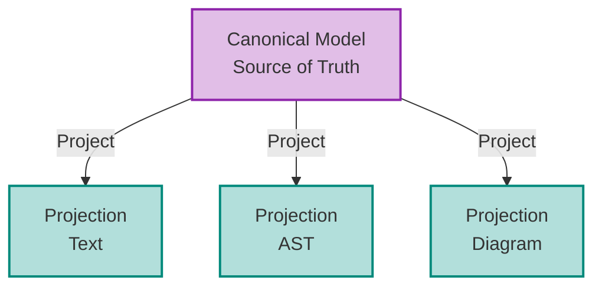

# Projectional Editing Architecture Plan

## Executive Summary

This plan outlines a **general theoretical architecture** for Projectional Editing that can be applied to any domain, with specific implementation guidance for the Lambda Calculus CRDT Editor. The core insight is treating **projections as lenses** over a canonical model, with **bidirectional transformations** maintaining semantic equivalence (bisimulation).

> **Status note (2026-03-18): This document is partly historical.**
>
> **What's current:**
> - Part 1 (theoretical architecture) — lens abstraction, bisimulation, edit action calculus. Sound theory, independent of implementation.
> - Phase 3 completed deliverables — `TreeEditorState`, `InteractiveTreeNode`, tree edit round-trip via `SyncEditor`.
>
> **What's retired or stale:**
> - `CanonicalModel`, `projection/canonical_model.mbt`, `projection/text_lens.mbt` — replaced by `SyncEditor` + memo-derived `ProjNode`/`SourceMap`.
> - The `CstNode` struct definition in §2.3 predates the seam library and is wrong — the actual `CstNode` is `{ kind: RawKind, children: Array[CstElement], text_len: Int, hash: Int, token_count: Int, has_any_error: Bool }`.
> - "AST-first canonical model" (§2.2, Confirmed Decisions) — the live system uses **text (CRDT) as ground truth** with AST derived via incremental parsing. The AST is not the canonical model.
> - "Future CST-aware version" labels in §2.4 — loom already provides CST-based incremental parsing via `CstNode`/`SyntaxNode`/`ReuseCursor`. The "future" is partially the present.
>
> **Live architecture:** `SyncEditor` + `TreeEditorState::from_projection` / `refresh`. See [modules.md](./modules.md) for the current structure.

---

## Part 1: Theoretical Architecture for General Projectional Editing

### 1.1 Core Concepts

#### The Projection Triangle



**Key Principle**: All projections are *derived views* of a single canonical model. Edits in any projection are transformed back to model operations, then propagated to all other projections.

#### Three-Layer Architecture

| Layer | Responsibility | Examples |
|-------|---------------|----------|
| **Model Layer** | Canonical data structure, CRDT operations | AST with unique node IDs, operation log |
| **Lens Layer** | Bidirectional transformations | Text↔AST, Visual↔AST parsers/unparsers |
| **Projection Layer** | UI rendering, user interaction | Text editor, tree visualizer, block editor |

### 1.2 The Lens Abstraction

A **Lens** provides bidirectional transformation between Model and Projection:

```
Lens[M, P] = {
  get:    M → P                    // Model to Projection (render)
  put:    (P, M) → M               // Updated Projection + old Model → new Model
  create: P → M                    // Create Model from Projection
}
```

**Critical Property: Bisimulation**
- `get(put(p, m)) ≈ p` — Editing in projection, then rendering, preserves semantics
- `put(get(m), m) = m` — Rendering then "editing" with same value is identity

### 1.3 Handling Incomplete States

The five problems from Structural Editing require explicit handling:

| Problem | Solution |
|---------|----------|
| **Syntactic malformation** | Error nodes in AST, partial parse trees |
| **Static meaninglessness** | Type-level error markers, deferred validation |
| **Dynamic meaninglessness** | Runtime error annotations, optional validation |
| **Edit action calculus** | Formal operation algebra per projection |
| **Intelligent suggestions** | Context-aware completion based on grammar |

**Key Insight**: The Model must support **incomplete/error states** as first-class citizens.

### 1.4 Edit Action Calculus

Each projection defines its own **edit operations** that map to model operations:

```
Text Projection Operations:
  insert(pos, char) → Model.insertNode / Model.updateLeaf
  delete(pos)       → Model.deleteNode / Model.updateLeaf

AST Projection Operations:
  insertChild(parent, index, node) → Model.insertNode
  deleteNode(node)                 → Model.deleteNode
  replaceNode(old, new)            → Model.replaceNode
  moveNode(node, newParent, index) → Model.moveNode
```

### 1.5 EG-Walker as Bidirectional Transformation Engine

**Key Insight**: The eg-walker algorithm's event graph can be extended to track **transformations between projections**, not just text operations. Each projection edit becomes an event in the causal graph, with cross-projection transformations as derived events.

```
┌────────────────────────────────────────────────────────────────────┐
│              EG-Walker Extended Event Graph                        │
├────────────────────────────────────────────────────────────────────┤
│                                                                    │
│  Event Types:                                                      │
│  ├─ TextOp(insert/delete at position)      ← Text projection      │
│  ├─ ASTOp(insert/delete/replace node)      ← AST projection       │
│  └─ TransformOp(TextOp ↔ ASTOp mapping)    ← Bidirectional link   │
│                                                                    │
│  Causal Graph tracks:                                              │
│  ├─ Which projection originated the edit                          │
│  ├─ Derived operations in other projections                       │
│  └─ Causality across projections (AST edit → derived Text edit)   │
│                                                                    │
│  Benefits:                                                         │
│  ├─ Unified undo/redo across projections                          │
│  ├─ Conflict resolution at projection boundaries                  │
│  ├─ Time-travel debugging (see edit in any projection)            │
│  └─ Collaborative editing with projection awareness               │
└────────────────────────────────────────────────────────────────────┘
```

**Transformation as Causal Events**:

```
User edits in AST projection:
  ASTOp[lv=5, parents=[4]] = InsertNode(λ, body, Var("y"))
                    │
                    ▼ (derived transformation)
  TextOp[lv=6, parents=[5]] = Insert(pos=3, "y")
                    │
                    ▼ (broadcast to peers)
  Remote peer applies TextOp, regenerates AST, reconciles
```

**Why eg-walker for bidirectional transformations?**

1. **Causality Tracking**: The CausalGraph already tracks operation dependencies. Extending it to track "this ASTOp caused this TextOp" is natural.

2. **Conflict Resolution**: When two users edit different projections simultaneously, the event graph can detect and resolve conflicts at the projection boundary.

3. **Time Travel**: The OpLog stores all operations. We can replay history in any projection, seeing how AST changes mapped to text changes.

4. **Undo/Redo**: Instead of per-projection undo, we can undo "logical operations" that span projections.

```moonbit
/// Extended operation for multi-projection CRDT
enum ProjectedOp {
  Text(TextOp)           // Insert/delete in text
  AST(ASTOp)             // Structural AST operation
  Transform {            // Bidirectional link
    source: OpId         // Original operation
    derived: OpId        // Derived operation
    projection: String   // Target projection
  }
}

/// Extended CausalGraph for projections
struct ProjectedCausalGraph {
  graph: CausalGraph                    // Existing eg-walker graph
  transforms: Map[OpId, Array[OpId]]    // source → derived ops
  projection_origins: Map[OpId, String] // Which projection created this op
}
```

### 1.6 CRDT Integration for Collaboration

For collaborative editing with multiple projections:

```
┌──────────────────────────────────────────────────────────────┐
│            EG-Walker Multi-Projection CRDT                   │
├──────────────────────────────────────────────────────────────┤
│                                                              │
│  ┌─────────────────────────────────────────────────────┐    │
│  │  Unified OpLog                                       │    │
│  │  ├─ TextOps: FugueMax sequence operations           │    │
│  │  ├─ ASTOps: Structural tree operations              │    │
│  │  └─ TransformOps: Cross-projection links            │    │
│  └─────────────────────────────────────────────────────┘    │
│                           │                                  │
│  ┌─────────────────────────────────────────────────────┐    │
│  │  CausalGraph (extended)                              │    │
│  │  ├─ Parents: causal dependencies                     │    │
│  │  ├─ Transforms: derived operation links              │    │
│  │  └─ Frontiers: per-projection version vectors        │    │
│  └─────────────────────────────────────────────────────┘    │
│                                                              │
└──────────────────────────────────────────────────────────────┘

Network Sync:
  1. Local AST edit → create ASTOp
  2. Derive TextOp via unparse diff
  3. Link with TransformOp
  4. Broadcast TextOp + TransformOp
  5. Remote: apply TextOp, use TransformOp hint for reconciliation
```

---

## Part 2: Architecture for Lambda Calculus Editor

### 2.1 Current State Analysis

The existing codebase has:

| Component | Status | Location |
|-----------|--------|----------|
| Text CRDT | ✅ Complete | `event-graph-walker/document/` |
| Lambda Parser | ✅ Complete | `loom/examples/lambda/` |
| AST (TermNode) | ✅ Complete | `loom/examples/lambda/src/ast/` |
| AST Visualization | ✅ DOT export | `loom/examples/lambda/src/dot_node.mbt` |
| AST↔CRDT Bridge | ✅ Complete | `editor/sync_editor*.mbt` |
| CanonicalModel | Retired | Replaced by SyncEditor + memo-derived ProjNode/SourceMap |
| SourceMap | ✅ Complete | `projection/source_map.mbt` |
| Text diff adapter | ✅ Complete | `projection/text_projection_diff.mbt` |
| TreeLens | ✅ Complete | `projection/tree_lens.mbt` |
| AST Reconciliation | ✅ Complete | `projection/reconcile_ast.mbt` |
| apply_operation | Retired | Replaced by `apply_edit_to_proj(...)` |
| SyncEditor tree edit bridge | ✅ Complete | `editor/tree_edit_bridge.mbt` |
| InteractiveTreeNode | ✅ Complete | `projection/tree_editor.mbt` |
| TreeEditorState | ✅ Complete | `projection/tree_editor.mbt` (immutable UI state, structural indexes, subtree reuse) |
| TreeUIState | ✅ Complete | `projection/tree_editor.mbt` (private refresh-time helper) |
| TreeEditorState::refresh | ✅ Complete | `projection/tree_editor.mbt` (rebuild + stale ID pruning) |
| Rabbita example integration | ✅ Complete | `examples/rabbita/main/main.mbt` |
| ProjectedEditor | ❌ Not started | Integration facade (Phase 3.5) |
| Bidirectional Sync | 🔶 Partial | — |
| CstNode | ✅ Complete | `loom/seam/` |
| AstCstMap | ✅ Complete | `loom/examples/lambda/src/term_convert.mbt` |
| CST-aware algorithms | ✅ Complete | `loom/` (incremental parsing via `ImperativeParser`) |

### 2.2 Proposed Architecture

```mermaid
graph TD
    %% Layers
    subgraph "Projection Layer (Web UI)"
        TextUI[Text Editor\n(contenteditable)]
        TreeUI[Unified Tree Editor\n(SVG/Canvas)]
    end
    
    subgraph "Lens Layer"
        Registry[Lens Registry]
        TextLens[TextLens]
        TreeLens[TreeLens]
    end
    
    subgraph "Model Layer (MoonBit)"
        PE[SyncEditor]
        CM[ProjNode + SourceMap\n(derived from AST)]
        CRDT[TextCRDT\n(FugueMax)]
    end
    
    %% Connections
    TextUI <--> TextLens
    TreeUI <--> TreeLens
    
    TextLens <--> Registry
    TreeLens <--> Registry
    
    Registry <--> PE
    PE --> CM
    
    CRDT -- "incremental parse" --> CM
    
    %% Styling
    classDef ui fill:#bbdefb,stroke:#1976d2,stroke-width:2px;
    classDef lens fill:#fff9c4,stroke:#fbc02d,stroke-width:2px;
    classDef model fill:#c8e6c9,stroke:#388e3c,stroke-width:2px;
    
    class TextUI,TreeUI ui;
    class Registry,TextLens,TreeLens lens;
    class PE,CM,CRDT model;
```

### 2.3 Core Data Structures

#### CanonicalModel (RETIRED — see status note)

```moonbit
/// RETIRED: replaced by SyncEditor + memo-derived ProjNode/SourceMap.
/// Kept here for historical reference.
struct CanonicalModel {
  ast: TermNode                        // Current AST
  node_registry: Map[NodeId, TermNode] // Fast node lookup
  source_map: SourceMap                // NodeId ↔ text positions
  dirty_projections: Set[ProjectionId] // Which projections need update
  edit_history: Array[ModelOperation]  // For undo/redo
}

/// Future extension (NOT YET IMPLEMENTED):
/// struct CanonicalModel {
///   ...existing fields...
///   cst: CstNode                       // Concrete syntax with trivia
///   ast_cst_map: AstCstMap             // NodeId ↔ CST token spans
/// }

/// Source position mapping
struct SourceMap {
  node_to_range: Map[NodeId, (Int, Int)]  // AST node → text range
  range_to_nodes: IntervalTree[NodeId]    // text range → AST nodes
}

/// Concrete syntax tree — IMPLEMENTED in seam (dowdiness/seam).
/// The actual definition (not the historical sketch above):
struct CstNode {
  kind: RawKind
  children: Array[CstElement]  // CstElement = Token(CstToken) | Node(CstNode)
  text_len: Int                // relative width, not absolute position
  hash: Int                    // structural content hash for incremental reuse
  token_count: Int             // non-trivia leaf count
  has_any_error: Bool          // fast error-skip flag
}

/// AstCstMap is not yet implemented. CstFold (memoized catamorphism)
/// handles CST→AST conversion incrementally without an explicit map.
```

#### CST Invariants (IMPLEMENTED in seam)

- CstNode stores relative widths, not absolute positions — subtrees are position-independent for O(1) incremental reuse.
- All source bytes are represented (whitespace, comments, error tokens) — the CST is lossless.
- ErrorNode is a CstNode with a different kind — the parser always produces a complete tree.
- SyntaxNode is an ephemeral positioned wrapper that computes absolute offsets lazily from widths.
- See [Incremental Hylomorphism §2](./Incremental-Hylomorphism.md) for the four structural independence properties.

#### Formatting Policy

- Local-only formatting: regenerations are limited to the affected CST subtree.
- Trivia outside the affected span is preserved verbatim.
- Whole-file normalization is opt-in and treated as an explicit formatting action.

#### ModelOperation (Edit Algebra)

```moonbit
/// Operations on the canonical model
enum ModelOperation {
  InsertNode(parent: NodeId, index: Int, node: TermNode)
  DeleteNode(node_id: NodeId)
  ReplaceNode(node_id: NodeId, new_node: TermNode)
  UpdateLeaf(node_id: NodeId, new_value: LeafValue)
  MoveNode(node_id: NodeId, new_parent: NodeId, new_index: Int)
}

/// Leaf values in AST nodes
enum LeafValue {
  IntValue(Int)
  VarName(String)
  OpSymbol(String)
}
```

#### Lens Trait (Bidirectional Transformation)

```moonbit
/// Generic lens for bidirectional sync
trait Lens[M, P] {
  get(model: M) -> P                    // Render model to projection
  put(projection: P, model: M) -> M     // Apply projection edits to model
  diff(old_p: P, new_p: P) -> Array[ProjectionEdit]  // Compute edits
}

/// Text lens: CanonicalModel ↔ String
struct TextLens { }

impl Lens[CanonicalModel, String] for TextLens {
  fn get(model: CanonicalModel) -> String {
    unparse(model.ast)  // AST → source text
  }

  fn put(text: String, model: CanonicalModel) -> CanonicalModel {
    let new_ast = parse(text)
    reconcile(model.ast, new_ast)  // Preserve node IDs where possible
  }
}

/// Tree lens: CanonicalModel ↔ InteractiveTree
struct TreeLens { }

impl Lens[CanonicalModel, InteractiveTree] for TreeLens {
  fn get(model: CanonicalModel) -> InteractiveTree {
    to_interactive_tree(model.ast, model.source_map)
  }

  fn put(tree: InteractiveTree, model: CanonicalModel) -> CanonicalModel {
    from_interactive_tree(tree)
  }
}
```

#### InteractiveTree (Unified Editor Data Structure)

```moonbit
/// Tree node with editing state for unified editor
struct InteractiveTreeNode {
  id: NodeId                      // Persistent ID from AST
  kind: TermKind                  // Node type
  label: String                   // Display label
  children: Array[InteractiveTreeNode]

  // Editing state
  selected: Bool                  // Currently selected
  editing: Bool                   // Inline editing active
  collapsed: Bool                 // Subtree collapsed
  drop_target: Bool               // Valid drop zone

  // Layout (computed by renderer)
  bounds: Option[Rect]            // Bounding box in canvas
  text_range: (Int, Int)          // Corresponding text range
}

/// Operations available in unified tree editor
enum TreeEditOp {
  // Selection
  Select(node_id: NodeId)
  SelectRange(start: NodeId, end: NodeId)

  // Inline editing
  StartEdit(node_id: NodeId)
  CommitEdit(node_id: NodeId, new_value: String)
  CancelEdit

  // Structural operations
  Delete(node_id: NodeId)
  WrapInLambda(node_id: NodeId, var_name: String)
  WrapInApp(node_id: NodeId)
  InsertChild(parent: NodeId, index: Int, kind: TermKind)

  // Drag and drop
  StartDrag(node_id: NodeId)
  DragOver(target: NodeId, position: DropPosition)
  Drop(source: NodeId, target: NodeId, position: DropPosition)

  // Navigation
  Collapse(node_id: NodeId)
  Expand(node_id: NodeId)
}

enum DropPosition {
  Before      // Insert before target
  After       // Insert after target
  Inside      // Insert as child of target
}
```

### 2.4 Key Algorithms

#### Algorithm 1: Text Edit → Model Update

**Current implementation** (AST-only, in `text_lens_put`):
```
TextEditToModel(old_text, new_text, model):
  1. Compute text diff: edits = diff(old_text, new_text)
  2. Parse new_text into new AST
  3. Reconcile new AST with old AST to preserve node IDs
  4. Update source_map for all nodes
  5. Mark AST projection as dirty
  6. Return new model
```

**CST-aware version** (PARTIALLY IMPLEMENTED via loom):

loom's `ImperativeParser` already handles steps 1-4 incrementally:
```
TextEditToModel(old_text, new_text, model):
  1. Compute edit: Edit { start, old_len, new_len }
  2. ImperativeParser::edit(edit, new_text) →
     - TokenBuffer re-lexes only the damage region
     - ReuseCursor reuses unchanged CST subtrees at O(1)
     - CstFold incrementally converts CST → AST (cache hits for unchanged subtrees)
  3. Reconcile AST with projection (preserve node IDs) — still needed
  4. Return new model
```
The gap: step 3 (AST reconciliation with stable node IDs for the projection layer) is not yet wired to loom's incremental output.

#### Algorithm 2: AST Edit → Model Update

**Current implementation** (AST-only, in `apply_operation`):
```
ASTEditToModel(ast_operation, model):
  1. Apply operation to model.ast:
     - InsertNode: Add child to parent at index
     - DeleteNode: Remove node and descendants
     - ReplaceNode: Substitute node preserving ID
     - MoveNode: Reparent node
  2. Update node_registry (register new nodes, unregister deleted)
  3. Record operation in edit_history
  4. Mark all projections as dirty
  5. Return success/failure
```

**CST-aware version** (PARTIALLY DESIGNED — see active plan):

The reverse direction (AST edit → text diff) requires unparsing the modified AST subtree
and computing a minimal text delta. This is the subject of the active
[projectional edit text delta design](../plans/2026-03-18-projectional-edit-text-delta-design.md).
```
ASTEditToModel(ast_operation, model):
  1. Apply operation to model.ast
  2. Unparse affected subtree → new text fragment
  3. Compute text delta (Edit { start, old_len, new_len })
  4. Apply delta to CRDT → incremental reparse via loom
  5. Return new model
```

#### Algorithm 3: AST Reconciliation (Preserve Node IDs)

```
Reconcile(old_ast, new_ast):
  1. If structurally identical:
     - Return old_ast (preserve all IDs)

  2. If same node kind:
     - Keep old node ID
     - Recursively reconcile children
     - Use LCS (Longest Common Subsequence) for child matching

  3. If different structure:
     - Generate new IDs for new nodes
     - Return new_ast with fresh IDs
```

### 2.5 Projection Synchronization Protocol

```
┌──────────┐     edit      ┌──────────────┐    ops     ┌──────────┐
│  Text    │──────────────▶│   Model      │───────────▶│   AST    │
│  Editor  │               │   Layer      │            │  Editor  │
└──────────┘               └──────────────┘            └──────────┘
     ▲                           │                          │
     │                           │                          │
     │      render               │        render            │
     └───────────────────────────┴──────────────────────────┘
```

**Synchronization Rules**:
1. Temporary simplification: locally only one projection can be "editing"
   at a time (focus-based). This will be relaxed for concurrent projections.
2. When projection P₁ edits:
   - Transform edit to ModelOperation
   - Apply to CanonicalModel
   - Mark other projections dirty
3. When projection P₂ renders:
   - Apply lens.get() to get current view
   - Diff with previous view for incremental update

### 2.6 Handling Incomplete States

```moonbit
/// Extended TermKind for incomplete states (PARTIAL - Error node exists)
enum TermKind {
  // ... existing kinds ...

  // Incomplete states
  Hole                         // Empty placeholder: _ (PLANNED)
  Error(message: String)       // Parse error (EXISTS in parser)
  Partial(expected: String)    // Incomplete input (PLANNED)
}

/// CST error handling (IMPLEMENTED in seam/loom)
/// ErrorNode is a CstNode with error_kind. IncompleteNode uses incomplete_kind.
/// Both are regular CstNodes — the parser always produces a complete tree.
/// See LanguageSpec { error_kind, incomplete_kind } in loom/core.

/// Validation levels (PLANNED)
enum ValidationLevel {
  Syntactic   // Is it parseable?
  Semantic    // Does it type-check?
  Dynamic     // Will it run without errors?
}
```

---

## Part 3: Implementation Roadmap

### Phase 1: Foundation (Core Infrastructure) — ✅ COMPLETE

**Status**: All core infrastructure implemented and tested (250 tests passing).

**Files created**:
- `projection/canonical_model.mbt` — CanonicalModel, node registry, dirty tracking
- `projection/source_map.mbt` — SourceMap with bidirectional position mapping
- `projection/types.mbt` — NodeId, ProjectionId, ModelOperation, LeafValue
- `projection/lens.mbt` — TextLens (get/put/diff), AST reconciliation
- `projection/tree_editor.mbt` — InteractiveTreeNode, TreeEditorState

**Deliverables** (all complete):
1. ✅ CanonicalModel data structure with node registry
2. ✅ SourceMap for bidirectional position mapping
3. ✅ ModelOperation enum definition
4. ✅ TextLens with unparse function (uses `@parser.print_term_node`)
5. ✅ AST reconciliation algorithm (preserves node IDs)
6. ✅ InteractiveTreeNode for tree projection

**Bug fixes applied**:
- Fixed lambda body ID assignment in reconcile (was not assigning fresh IDs)
- Rewrote `text_lens_diff` with proper prefix/suffix detection
- Added `unregister_node_tree` to properly clean up registry during reconciliation
- Fixed `apply_edit` to shift positions backward (not forward) on deletions

### Phase 2: AST Editing (Structural Operations) — ✅ COMPLETE

**Status**: All core AST editing operations implemented and tested (264 tests passing).

**Files modified**:
- `projection/canonical_model.mbt` — Implemented `apply_operation` with all variants
- `projection/lens.mbt` — Completed all `tree_lens_apply_edit` handlers
- `projection/canonical_model_wbtest.mbt` — Added 14 tests for apply_operation and tree_lens_apply_edit

**Deliverables** (all complete):
1. ✅ TreeLens with `tree_lens_get` and `tree_lens_apply_edit`
2. ✅ TreeEditOp enum with all structural operations defined
3. ✅ Pretty-printer via existing `@parser.print_term_node`
4. ✅ `apply_operation` implementation:
   - `InsertNode` — Find parent, insert child at index, register node
   - `DeleteNode` — Find parent, remove from children, unregister recursively
   - `ReplaceNode` — Replace in parent's children, update registry
   - `UpdateLeaf` — Parse new value and update node kind
   - `MoveNode` — Remove from old parent, insert at new location
5. ✅ Complete TreeEditOp handlers:
   - `CommitEdit` → parse value, create ReplaceNode operation
   - `Delete` → create DeleteNode operation
   - `WrapInLambda` → wrap node in lambda, ReplaceNode
   - `WrapInApp` → wrap node in App, ReplaceNode
   - `InsertChild` → parse placeholder, create InsertNode
   - `Drop` → create MoveNode with position-based indexing

**Helper functions added**:
- `find_parent(node_id)` — traverse tree to find parent and index
- `update_node_in_tree(root, node_id, new_node)` — immutable tree update
- `remove_child_at(node, index)` — remove child from node
- `insert_child_at(node, index, child)` — insert child into node
- `get_node_in_tree(root, target_id)` — find node by ID in tree

### Phase 3: Unified Tree Editor (Interactive Visualization) — 🔶 IN PROGRESS

**Prerequisites**: Phase 2 must be complete first. ✅

**Status**: The MoonBit tree editor core is implemented and integrated in the
`examples/rabbita` app. A generic reusable web tree widget / projection manager
layer is still pending.

**Files created/modified**:
- ✅ `projection/tree_editor.mbt` — TreeEditorState with immutable UI state
- ✅ `projection/tree_editor_wbtest.mbt` — White-box coverage for reuse, elision, hydration, and guard paths
- ✅ `editor/tree_edit_bridge.mbt` — Tree edit bridge through `SyncEditor`
- ✅ `examples/rabbita/main/main.mbt` — Active Rabbita integration example
- ❌ `crdt/src/crdt.mbt` — Extended FFI for generic tree operations
- ❌ `examples/web/src/tree-editor.ts` — Unified tree editor component
- ❌ `examples/web/src/tree-renderer.ts` — SVG/Canvas tree rendering
- ❌ `examples/web/src/projection-manager.ts` — Projection synchronization
- ❌ `examples/web/src/editor.ts` — Integrate with projection system

**Completed Deliverables**:
1. ✅ `TreeEditorState` — Manages UI-only state separate from model:
   - `collapsed_nodes: @immut/hashset.HashSet[NodeId]` — Immutable for undo safety
   - `selection: Array[NodeId]` — Multi-select support
   - `editing_node: NodeId?` — Inline edit tracking
   - `dragging/drop_target/drop_position` — Drag-and-drop state
2. ✅ `InteractiveTreeNode` — Derived view with flags:
   - `selected`, `editing`, `collapsed`, `drop_target` derived from `TreeUIState`
   - Flags computed during tree construction, not stored separately
3. ✅ `TreeEditorState::refresh(...)` — Rebuild, subtree reuse, and stale ID pruning
4. ✅ Guards for invalid operations:
   - `Collapse`/`Expand` on missing nodes → no-op
   - `DragOver`/`Drop` on self or descendant → rejected
   - `Drop` with mismatched source → clears drag state only
5. ✅ Collapsed-descendant elision and targeted rehydration:
   - collapsed descendants are represented as `InteractiveChildren::Elided`
   - `expand_node(...)` hydrates elided branches when the projection snapshot is clean
6. ✅ Tree edits round-trip through text:
   - structural edits use `SyncEditor::apply_tree_edit(...)`
   - `Delete` replaces fixed-arity terms with valid placeholders so edits remain printable

**Pending Deliverables**:
1. ❌ JavaScript API for generic tree operations (FFI binding)
2. ❌ **Reusable web tree editor** that combines visualization + editing outside Rabbita:
   - Click node to select/focus
   - Double-click to edit leaf values inline
   - Drag nodes to reorder/reparent
   - Context menu for structural operations (wrap in λ, delete, etc.)
   - Visual feedback during edits (highlight affected regions)
3. ❌ Projection manager handling focus and sync
4. ❌ Side-by-side Text ↔ Tree view with synchronized cursors

**Unified Tree Editor Design**:
```
┌────────────────────────────────────────────────────────────┐
│  Unified Tree Editor                                        │
├────────────────────────────────────────────────────────────┤
│                                                            │
│              ┌─────┐                                       │
│              │ App │ ← click to select                     │
│              └──┬──┘                                       │
│         ┌──────┴──────┐                                    │
│         ▼             ▼                                    │
│      ┌─────┐      ┌─────┐                                  │
│      │ Lam │      │ Var │ ← double-click to rename         │
│      │ x   │      │  y  │                                  │
│      └──┬──┘      └─────┘                                  │
│         ▼                                                  │
│      ┌─────┐                                               │
│      │ Bop │ ← right-click for context menu                │
│      │  +  │   [Wrap in λ] [Delete] [Copy]                 │
│      └──┬──┘                                               │
│    ┌────┴────┐                                             │
│    ▼         ▼                                             │
│ ┌─────┐  ┌─────┐                                           │
│ │ Var │  │ Int │ ← drag to reorder                         │
│ │  x  │  │  1  │                                           │
│ └─────┘  └─────┘                                           │
│                                                            │
│ [+ Add λ] [+ Add If] [+ Add Op]  ← insertion palette       │
└────────────────────────────────────────────────────────────┘
```

### Phase 3.5: Integration Layer — ❌ NOT STARTED

**Prerequisites**: Phase 3 Completed Deliverables must be working.

**Purpose**: Connect MoonBit state management to Web UI via event routing.

**Architecture**:

```
┌─────────────────────────────────────────────────────────────────────┐
│                        Web UI (Svelte/React)                         │
├─────────────────────────────────────────────────────────────────────┤
│  ┌─────────────────────────┐  ┌───────────────────────────────┐    │
│  │      Text Editor        │  │      Tree Editor              │    │
│  │    (CodeMirror)         │  │   (SVG with D3/Solid)         │    │
│  └───────────┬─────────────┘  └───────────────┬───────────────┘    │
│              │                                │                     │
│              ▼                                ▼                     │
│  ┌─────────────────────────────────────────────────────────────┐   │
│  │                    Event Router (JS)                         │   │
│  │  - TextInsert/Delete → text_lens_apply_edit()               │   │
│  │  - TreeEditOp → tree_lens_apply_edit() + apply_edit()       │   │
│  │  - Dispatches to MoonBit FFI                                 │   │
│  └─────────────────────────────────────────────────────────────┘   │
└─────────────────────────────────────────────────────────────────────┘
                                    │
                                    ▼ FFI Calls
┌─────────────────────────────────────────────────────────────────────┐
│                      MoonBit Layer                                   │
├─────────────────────────────────────────────────────────────────────┤
│  ┌─────────────────────────────────────────────────────────────┐   │
│  │                 ProjectedEditor (to be created)              │   │
│  │  ┌────────────────────────────────────────────────────────┐ │   │
│  │  │  model: CanonicalModel (AST + source_map + registry)   │ │   │
│  │  │  ui_state: TreeEditorState (selection, collapsed, etc) │ │   │
│  │  │  text_crdt: Document (eg-walker FugueMax)              │ │   │
│  │  └────────────────────────────────────────────────────────┘ │   │
│  │                                                              │   │
│  │  fn apply_text_edit(pos, text) -> ProjectedEditor           │   │
│  │    1. Update text_crdt                                       │   │
│  │    2. Reparse → new AST                                      │   │
│  │    3. Reconcile AST (preserve node IDs)                      │   │
│  │    4. ui_state.refresh(proj, source_map) (prune stale IDs)  │   │
│  │    5. Return updated editor                                  │   │
│  │                                                              │   │
│  │  fn apply_tree_edit(op: TreeEditOp) -> ProjectedEditor       │   │
│  │    1. ui_state.apply_edit(op) → update UI state             │   │
│  │    2. If structural: tree_lens_apply_edit(model, op)        │   │
│  │    3. Unparse → text diff → update text_crdt                │   │
│  │    4. Return updated editor                                  │   │
│  │                                                              │   │
│  │  fn get_text() -> String                                     │   │
│  │  fn get_tree() -> InteractiveTreeNode?                       │   │
│  └─────────────────────────────────────────────────────────────┘   │
└─────────────────────────────────────────────────────────────────────┘
```

**Key Design Decisions from Implementation**:

| Decision | Rationale |
|----------|-----------|
| **Immutable `collapsed_nodes`** | Uses `@immut/hashset` to prevent aliasing bugs in undo/redo scenarios |
| **Derived node flags** | `selected`/`editing`/`drop_target` computed from `TreeUIState` during tree construction, not stored on nodes |
| **Stale ID pruning** | `TreeEditorState::refresh(...)` removes UI IDs that no longer exist in the current projection snapshot |
| **Guards on operations** | `Collapse`/`Expand`/`DragOver`/`Drop` validate node existence and prevent self/descendant drops |
| **UI state separate from model** | `TreeEditorState` holds ephemeral UI state; `CanonicalModel` holds persistent data |
| **Hidden subtree handling** | Collapsed descendants can be elided from the interactive tree while structural indexes remain available |
| **Expand hydration** | `expand_node(...)` rehydrates elided branches without requiring a full text edit round-trip |

**Files to create**:
- `projection/projected_editor.mbt` — Unified editor facade
- `crdt.mbt` (root) — FFI exports for JS
- `examples/web/src/event-router.ts` — JS event dispatcher
- `examples/web/src/moonbit-bridge.ts` — FFI wrapper

**Unused Constructors Resolution**:
The following will be used when the integration layer is built:

| Variant | Used By |
|---------|---------|
| `ProjectionEdit::NodeSelect` | Event router when tree selection syncs to text cursor |
| `ProjectionEdit::StructuralChange` | Undo/redo system for logical operation grouping |
| `TreeEditOp::*` | Already used by `tree_lens_apply_edit()` |
| `DropPosition::Before/After/Inside` | Already used in `Drop` handling (line 196-204) |
| `LeafValue::*` | Will be used for typed inline editing |
| `ValidationLevel::*` | Will be used for incremental validation |

### Phase 4: Advanced Features (Polish) — ❌ NOT STARTED

**Prerequisites**: Phase 3.5 must be complete first.

**Features**:
- Keyboard navigation in tree (arrow keys, Enter to edit)
- Drag-and-drop with drop-zone highlighting
- Selection synchronization (select in text ↔ highlight in tree)
- Undo/redo across projections via eg-walker TransformOps
- Zoom/pan for large trees
- Collapse/expand subtrees

---

## Part 4: Verification Strategy

### Unit Tests

```moonbit
// Test lens laws
test "TextLens roundtrip" {
  let model = create_model("λx.x+1")
  let text = TextLens::get(model)
  let model2 = TextLens::put(text, model)
  assert_eq!(model.ast, model2.ast)
}

test "ASTLens roundtrip" {
  let model = create_model("λx.x+1")
  let ast = ASTLens::get(model)
  let model2 = ASTLens::put(ast, model)
  assert_eq!(TextLens::get(model), TextLens::get(model2))
}

// Lens law equivalence is semantic; trivia may differ unless edits are
// whitespace-only, in which case trivia should be preserved.

// Test reconciliation preserves IDs (IMPLEMENTED - see lens_wbtest.mbt)
test "reconcile preserves node IDs" {
  let model1 = create_model("λx.x")
  let model2 = edit_text(model1, "λx.x+1")
  // λ and x nodes should keep same IDs
  assert_eq!(model1.node_registry["lam_id"], model2.node_registry["lam_id"])
}

// CST stability tests (PLANNED - requires CST implementation)
test "whitespace preserved across AST edit" {
  let model1 = create_model("λx.  x")
  let model2 = edit_ast(model1, WrapInLambda)
  assert_eq!(TextLens::get(model2).contains("  "), true)
}

test "comments preserved across text edit" {
  let model1 = create_model("x /*c*/ + 1")
  let model2 = edit_text(model1, "x /*c*/ + 2")
  assert_eq!(TextLens::get(model2).contains("/*c*/"), true)
}
```

### Integration Tests

1. **Text → AST sync**: Edit text, verify AST updates correctly
2. **AST → Text sync**: Edit AST node, verify text regenerates correctly
3. **Roundtrip**: Edit text → view AST → edit AST → view text
4. **CRDT collaboration**: Two users edit different projections simultaneously

### Manual Testing

**Basic Flow**:
1. Open app in browser
2. Type `λx.x+1` in text editor
3. Verify tree visualization updates in real-time
4. Click on a node in tree → verify text cursor moves to corresponding position
5. Double-click on `x` variable → edit inline to `y`
6. Verify text updates to `λy.y+1`

**Structural Editing**:
7. Right-click on `+` node → select "Wrap in λ"
8. Verify tree shows new lambda, text updates to `λy.(λz.y+1)`
9. Drag the `1` node before the `y` node
10. Verify text updates to `λy.(λz.1+y)`

**Error Handling**:
11. Delete text partially: `λx.x+`
12. Verify tree shows Error node for incomplete expression
13. Complete the expression: `λx.x+2`
14. Verify Error node resolves to Int node

**Collaboration Simulation**:
15. Open two browser windows
16. Edit text in window 1 → verify tree updates in window 2
17. Edit tree in window 2 → verify text updates in window 1

---

## Key Design Decisions Summary

| Decision | Rationale |
|----------|-----------|
| **AST as canonical model** | Richer than text, enables structural operations |
| **Text CRDT for collaboration** | Leverage existing FugueMax implementation |
| **Lens abstraction** | Clean separation, extensible to new projections |
| **Node ID preservation** | Enables AST-level collaboration, cursor stability |
| **Lazy projection updates** | Performance: only render visible projections |
| **Error nodes in AST** | First-class incomplete states, no invalid states |

---

## Confirmed Design Decisions

Based on user input (updated 2026-03-18 to reflect current architecture):

| Decision | Choice | Implication |
|----------|--------|-------------|
| **Ground truth** | Text CRDT (FugueMax) | Text is truth; AST is derived via incremental parsing (loom). This reversed the earlier "AST-first" plan. |
| **CRDT granularity** | Text CRDT only | Keep existing FugueMax, regenerate AST per-peer via `ImperativeParser` |
| **Error handling** | Error nodes | Invalid regions become `Term::Error(msg)` in AST, `ErrorNode` in CST |
| **Incremental parsing** | loom framework | `CstNode`/`SyntaxNode` two-tree model with `ReuseCursor` for O(1) subtree reuse |

### Current Constraints

- Local single-projection edit lock to simplify conflict handling.
- Tree edits round-trip through text (unparse → text delta → CRDT → reparse).

### Architecture Consequence (Updated)

```
┌─────────────────────────────────────────────────────────────┐
│               Text CRDT (Ground Truth)                      │
│  FugueMax document, collaborative, character-level ops      │
└────────────────────────┬────────────────────────────────────┘
                         │
                         ▼ incremental parse (loom)
┌─────────────────────────────────────────────────────────────┐
│               CST → AST (Derived)                           │
│  CstNode (seam) → SyntaxNode → CstFold → Term              │
│  ProjNode/SourceMap reconciled with stable NodeIds          │
└────────────────────────┬────────────────────────────────────┘
                         │
         ┌───────────────┴───────────────┐
         │                               │
         ▼                               ▼
┌─────────────────┐             ┌─────────────────────────┐
│   Text View     │             │   Unified Tree Editor   │
│   (source text) │             │   (View + Edit in one)  │
└─────────────────┘             └─────────────────────────┘
```

**Data flow**:
1. Text edit → CRDT op → incremental reparse (loom) → new AST → update tree editor
2. Tree edit → unparse → text diff → CRDT op → incremental reparse → reconcile
3. Remote CRDT ops → apply → incremental reparse → reconcile AST (preserve IDs)
