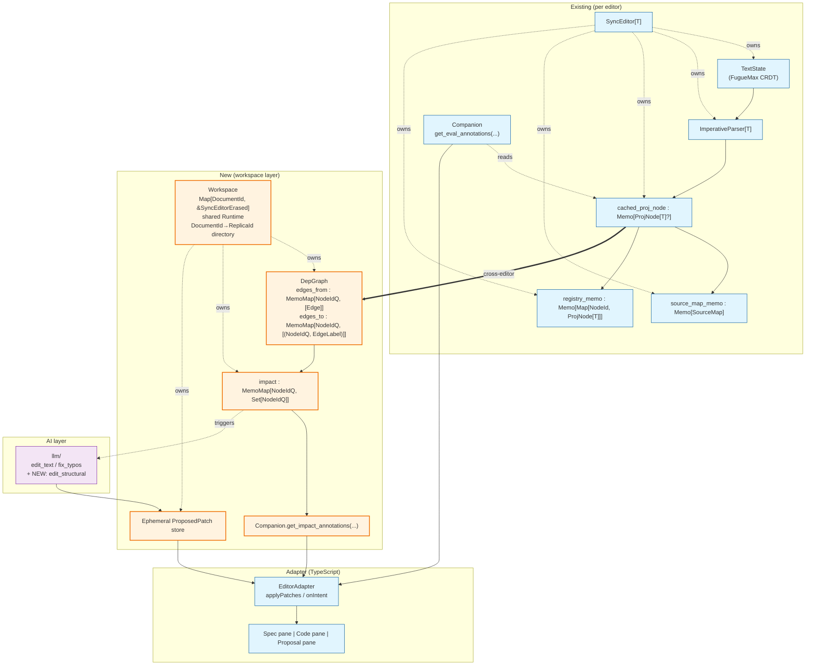

# Research: Canopy as a Specification-Aware Development Workspace

**Date:** 2026-05-22
**Status:** Research / Prototype Investigation
**Author:** Claude (research agent)
**Worktree base:** `origin/main @ 72e5391`

## Revisions

- **2026-05-22 (initial):** §§1–8 + appendices written from four parallel subagent inventories that ran without `loom/` submodule checked out in the worktree.
- **2026-05-22 (post-incr-verification):** §1.5, §3.3, §3.7, §3.8, §6.3, Appendix B #3/#4/#16, Appendix C #2 rewritten after direct read of `loom/incr/cells/pkg.generated.mbti` and `loom/incr/cells/datalog_relation.mbt`. The substrate is `@incr.MemoMap` + Datalog `Relation`/rules + `Runtime::fixpoint`, not alga overlay. alga retreats to batch-only snapshot algorithms.
- **2026-05-22 (post-Codex-review):** §3.2, §3.3, §3.4, §3.5, §5.2, §5.3, §6.5, §7.3, Appendix B (3 new P0 experiments), Appendix C (#1 promoted, #9 added) rewritten after independent design review. Two hypotheses were refuted: (a) `UserIntent::StructuralEdit.params: Map[String, String]` does **not** fit existing structural ops (`Drop` needs numeric NodeIds, `InsertChild` carries an AST `Term`); the AI patch surface requires a per-language typed schema or widening `params` to `Map[String, Json]`. (b) `TreePropertyOp` lives in `event-graph-walker/container/document.mbt`, not in the `event-graph-walker/text/` layer that `SyncEditor` uses today; the proposed persistence path needs a different design. Plus: `EditorId = agent_id` is unsafe (replica-id reuse causes silent CRDT collisions per `container/document.mbt:348–352`) — `NodeIdQ` must qualify by a stable `DocumentId` separate from replica id.

---

## Reading guide

Every claim grounded in source has a file:line citation. The text is layered as:

- **Fact:** verified by reading the named file at the named line.
- **Interpretation:** a synthesis the agent draws from facts; revisable.
- **Speculation:** a hypothesis about future direction; needs experimental validation.

Each subsection that draws an inference labels it explicitly.

---

## 1. Current Architecture Summary

### 1.1 The five-stage pipeline

**Fact** (`docs/architecture.md:13–16`, `docs/architecture/ARCHITECTURE_DIAGRAM.md`):

```
Text CRDT ─► Incremental parse ─► Projection ─► View patches ─► Frontend
   ▲                                                                 │
   └────────────── structural edits feed back ───────────────────────┘
```

| Stage | Owner | Anchor type |
|---|---|---|
| Text CRDT | `event-graph-walker/text/text_doc.mbt:5` | `TextState` (FugueMax sequence + `RawVersion`) |
| Incremental parse | `loom/loom/src/incremental/imperative_parser.mbt:5–10` | `ImperativeParser[Ast]` driven by `Edit { start, old_len, new_len }` |
| Projection | `core/proj_node.mbt:7` | `ProjNode[T] { node_id, kind: T, children, start, end }` |
| Reactive memo layer | `loom/incr/incr.mbt:25–48` | `Signal[T]`, `Memo[T]`, `Runtime`, `Observer`, `Watch` |
| Wire protocol | `protocol/view_patch.mbt:79–95` | `ViewPatch` (10 variants) + `ViewNode { id, kind_tag, label, text, children, annotations, ... }` |
| Adapter | `adapters/editor-adapter/adapter.ts:5–14` | `EditorAdapter { applyPatches, onIntent, destroy }` |

The single per-language coordinator is `SyncEditor[T]` (`editor/sync_editor.mbt:9–34`), which owns the `TextState`, the `ImperativeParser`, and three derived memos (`cached_proj_node`, `registry_memo`, `source_map_memo`). It exposes 49 public methods across 6 files.

### 1.2 Stable identity

**Fact** (`core/types.mbt:6`): `pub struct NodeId(Int) derive(Debug, Eq, Hash, Compare)`. Generated per-document via a counter. Preserved across reparses by `core/reconcile.mbt:5`, which runs LCS over children using the `TreeNode::same_kind` (`loom/loom/src/core/proj_traits.mbt:7–10`) equivalence and reuses the old `node_id` when kinds match.

**Interpretation:** NodeId is the canonical anchor for any cross-artifact link. It survives reparses but not cross-document recreation (each `SyncEditor` has its own counter — `core/reconcile.mbt:5` takes a `Ref[Int]` counter). For workspace-scale linking, identity must be qualified — at minimum `(EditorId, NodeId)`, or a globally unique CRDT-style `(agent, counter)` pair as in `event-graph-walker/internal/movable_tree/types.mbt:7` (`TreeNodeId { agent: String, counter: Int }`).

### 1.3 Side-table-as-annotation idiom

**Fact**: Multiple subsystems already use `Map[NodeId, T]` as a per-node side table:

- `core/source_map.mbt:9` — `node_to_range: Map[NodeId, Range]` plus `token_spans: Map[NodeId, Map[String, Range]]`
- `core/proj_node.mbt:58–62` — registry construction in `collect_registry`
- `projection/tree_editor_model.mbt:232` — `loaded_nodes: Map[NodeId, InteractiveTreeNode[T]]`
- `lang/lambda/companion/pkg.generated.mbti:36` — `LambdaCompanion::get_eval_annotations(...) -> Map[NodeId, Array[@protocol.ViewAnnotation]]`

**Interpretation:** Any new annotation layer (impact, provenance, spec-link) should follow this idiom — a fresh `Map[NodeId, V]`-typed memo + a companion method that reshapes the memo's output into `Array[ViewAnnotation]` per NodeId. The `eval_memo → get_eval_annotations` path (`lang/lambda/eval/eval_memo.mbt:206`) is the canonical example.

### 1.4 ViewAnnotation as the surface for downstream-of-AST information

**Fact** (`protocol/view_node.mbt:64–75`): `ViewNode` carries `annotations: Array[ViewAnnotation]` per node. `ViewPatch::UpdateNode` and `ViewPatch::ReplaceNode` deliver per-node updates incrementally (`protocol/view_patch.mbt:79–95`).

**Interpretation:** A new annotation kind (e.g. "this node is affected by spec X") slots in here without protocol-shape change. The protocol is annotation-extensible; only the `ViewAnnotation` variant set may need extension.

### 1.5 Reactive engine (incr)

**Fact** (`loom/incr/cells/pkg.generated.mbti`, verified directly): the substrate is much richer than the first-pass agent inventory captured. Public surface includes:

- **Scalar reactive cells** — `Signal[T]`, `TrackedCell[T]`, `Input[T]`, `Reactive[T]`, `Memo[T]`, `HybridMemo[T]`, `Derived[T]`, `EagerDerived[T]`, `ReachableDerived[T]`, `Observer[T]`, `Watch[T]`, `Effect`.
- **Keyed collections** — `MemoMap[K, V]` (`cells/pkg.generated.mbti:162–175`): per-key memoization with `MemoMap::get(K) -> V`, `sweep() -> Int` for eviction. Each key's compute is cached and invalidated independently. `DerivedMap[K, V]` (`cells/pkg.generated.mbti:45–58`): same shape, different evaluation strategy.
- **Datalog primitives** — `Relation[T]` (`cells/datalog_relation.mbt:11–17`): a typed tuple set with `current` + `delta` + `staged_delta` Refs, exposing `insert(T) → Bool`, `contains(T)`, `iter()`, **`delta_iter()`** (only what changed since last drain). `FunctionalRelation[K, V]` (`cells/pkg.generated.mbti:76–87`): keyed relation with optional `merge: (V, V) → V`. `Runtime::new_rule(input_relations, output_relations, apply_delta, label?) -> RuleId` (`cells/datalog_rule.mbt:2–8`) declares rules; `Runtime::fixpoint()` (`cells/pkg.generated.mbti:229`) runs them to convergence under seminaive evaluation.
- **Folding** — `Accumulator[T]` (`cells/pkg.generated.mbti:14–23`) collects values pushed during memo evaluation; readable via `Memo::accumulated(memo, acc)`.

Per `lang/lambda/eval/eval_memo.mbt:206`, a scalar `Memo[T]` is constructed via `@incr.Memo::new(runtime, compute_fn, label="...")` with callee-traced dependencies — the `compute_fn` reads `Signal`/`Memo` values, which the runtime auto-tracks.

**Interpretation:** This is differential-dataflow-class machinery, already production-tested in the existing codebase (the `wbtest` and `bench_test` suites — `cells/push_efficiency_bench_test.mbt`, `cells/accumulator_restore_bench_wbtest.mbt`, `cells/memo_dep_diff_wbtest.mbt` — establish that perf, dependency tracking, and disposal lifecycle work).

For a workspace-scale dependency graph, the right pattern is **`MemoMap[NodeIdQ, Array[Edge]]` as the primary substrate**, with `Relation[T]` + Datalog rules as an escalation path for transitive closure if BFS-per-key memoization becomes too slow. No new reactive primitives required. The "build incremental graph state" question is downstream of "what does incr already do" — and the answer is: most of it.

**Caveat for monotonic relations:** `Relation::insert` adds tuples; there is no public `remove`. Pure Datalog is monotonic. For dep-graph use where edges can disappear (a spec anchor is deleted), `MemoMap` per-source-key (whose compute fn returns the *current* edge set, re-derived when the source projection changes) handles deletion naturally. `Relation` + rules become the right substrate only for the derived closure layer, where pure addition + revision tagging works.

### 1.6 Multi-block, multi-property CRDT under the hood

**Fact** (`event-graph-walker/container/document.mbt`): The CRDT `Document` model is a `MovableTree` of nodes where each `TreeNodeId { agent: String, counter: Int }` (`event-graph-walker/internal/movable_tree/types.mbt:7`) can hold per-block FugueMax text via `TextBlock` and arbitrary `TreePropertyOp { target, key: String, value: String }` properties (`event-graph-walker/internal/movable_tree/types.mbt:41`).

**Interpretation:** The CRDT layer already supports a multi-block document with typed blocks (via properties). A "specification block" vs "code block" tagging is expressible today without rewriting the CRDT. The current single-document `SyncEditor` does not exploit this — but the substrate exists.

### 1.7 Hylomorphism framing — the architecture knows about the gap

**Fact** (`docs/architecture/Incremental-Hylomorphism.md:226–231, 270–276`): The document explicitly names "CST → Typed AST" as **the hardest boundary** and writes:

> *Damage propagation through semantics. Changing one function's signature can invalidate type-checking results in another file. Damage can jump to physically distant locations. An incr/Salsa-style query-based dependency graph is needed to track what must be recomputed.*

**Interpretation:** The user's research target — dependency tracking with cross-artifact damage propagation — is already framed as the next architectural boundary. The work is not a new direction; it is the *explicitly anticipated next layer* of the existing hylomorphism chain.

### 1.8 Assumptions baked into the current architecture

| Assumption | Citation | Implication for spec-awareness |
|---|---|---|
| Text is ground truth | `docs/architecture.md:80–82` | Spec must also be text-backed (or wrapped to look like text from the CRDT's perspective) |
| Single-document `SyncEditor` | `editor/sync_editor.mbt:9–34`; `docs/architecture.md:128` ("no workspace concept") | A multi-document workspace owner does not exist and must be added |
| NodeId is per-document | `core/types.mbt:6`; `core/reconcile.mbt:5` | Cross-document refs need qualified IDs |
| Adapter is single-view | `adapters/editor-adapter/adapter.ts:5–14` | A "spec/code split-pane" needs a new adapter composition or a host-side layout |
| No labeled edges in alga | `alga/src/graph_expr.mbt:47–52` (Graph algebra over `Int` vertices) | Dependency graph needs per-relation graphs or a labeled-graph wrapper |

---

## 2. Gap Analysis

For each of the user's five target capabilities, the table identifies what exists today and what's missing.

### 2.1 Specification-aware editing

| Need | Today | Missing |
|---|---|---|
| Parser + AST for the spec format | None | A `loom/examples/<spec>/` parser; the smallest precedent is Markdown |
| Projection layer | None | `lang/<spec>/proj/` (~120 lines per `docs/development/ADDING_A_LANGUAGE.md:504`) |
| Structural edit ops | None | `lang/<spec>/edits/` (~40 lines per the same reference) |
| Spec-side companion | None | `lang/<spec>/companion/` factory |
| Cross-artifact references inside the spec | None | A syntax form (anchor / link) — e.g. `[ref: <NodeId>]` parsed as a leaf in the spec AST |
| **Estimated cost to add a passive spec language**: | **~1235 lines, mechanical** | Per Markdown baseline |

**Interpretation:** Adding a spec language is mechanically identical to adding Markdown. No framework change.

### 2.2 Dependency tracking

| Need | Today | Missing |
|---|---|---|
| Per-node-ID side tables | Used throughout (§1.3) | Nothing — pattern is established |
| Graph algebra | `alga/src/graph_expr.mbt` provides `Graph` (Empty/Vertex/Overlay/Connect), `AdjacencyMap`, `foldg`, traversal, toposort, SCC | (a) **labeled edges** are absent; (b) **incremental mutation** is absent — graphs are immutable, batch-built |
| Reactive recomputation | `@incr.Memo` chained ad-hoc | Nothing — the pattern is in `eval_memo.mbt` |
| Cross-document signal | EphemeralHub broadcasts within fixed namespaces (Cursor / EditMode / Drag / Presence — `editor/ephemeral.mbt:2–7`) | A workspace-level Runtime + cross-editor Signal/Memo wiring |

**Interpretation:** The hardest part is **multiple editors sharing one incr `Runtime`** so a Memo can subscribe to multiple `cached_proj_node` signals. This is a workspace-owner concern, not an incr concern.

### 2.3 Impact analysis

| Need | Today | Missing |
|---|---|---|
| Compute affected NodeIds when an upstream node changes | `eval_memo.mbt` does this for "evaluation result per definition" but only within one Module | A `Memo[Map[NodeId, ImpactReason]]` constructed by walking the dep graph from a changed source set |
| Surface impact in UI | `LambdaCompanion::get_eval_annotations(...) -> Map[NodeId, Array[ViewAnnotation]]` (`lang/lambda/companion/pkg.generated.mbti:36`) is the template | Adapt to `get_impact_annotations(...)` |
| Diagnostic rendering | `ViewPatch::SetDiagnostics(Array[Diagnostic])` exists (`protocol/view_patch.mbt:79–95`) | Decide whether impact is a `Diagnostic` (severity-tagged) or a new `ViewAnnotation` kind |

**Interpretation:** Impact analysis is a Memo + a companion-method + a ViewAnnotation rendering decision. No new protocol type required if `ViewAnnotation` is rich enough.

### 2.4 AI patch generation

| Need | Today | Missing |
|---|---|---|
| Network/LLM call | `llm/fetch_ffi.mbt`, `llm/gemini.mbt` — Gemini-only via direct `fetch` (`docs/plans/2026-04-04-llm-integration-design.md`) | Other providers; nothing critical |
| Output type the LLM produces | `llm/types.mbt:2–7` — `EditAction { Replace(line), Insert(line), Delete(line), FixTypos }` (**text-only, line-based, no NodeId**) | Structural variants targeting NodeIds |
| Wire-format for structural patches | `protocol/user_intent.mbt:11–23` — `StructuralEdit(node_id, op: String, params: Map[String, String])` exists but is too narrow (see §5.2 revision) | LLM is not currently asked to emit this; no prompt produces it; no parser turns LLM JSON into `StructuralEdit`. **And** `params` values are string-only, so it cannot today represent `Drop` (numeric NodeIds, `lang/lambda/companion/tree_edit_json.mbt:215–219`) or `InsertChild(... kind: @ast.Term)` (carries an AST node, `lang/lambda/edits/tree_lens.mbt:19`). |
| Validation of LLM output | None — JSON parsed directly into `EditAction` (per agent inventory) | Schema check: does the proposed `op` exist in this language's `*EditOp` enum? Does `node_id` resolve to a node whose `kind_tag` is compatible? |
| Provenance | None — once committed, an LLM-originated CRDT op is indistinguishable from a human's | Tag origin (e.g. `agent_id = "llm:gemini-2.5-flash:request-N"`) — CRDT op already carries `agent: String` (`event-graph-walker/internal/core/operation.mbt`) so this is just naming convention |
| Review workflow | None | UI: preview pane + accept/reject; storage: ephemeral side store for un-committed proposals |

**Interpretation (revised post-Codex-review):** The structural wire protocol *shape* exists (`UserIntent::StructuralEdit`), but its `params: Map[String, String]` payload is too narrow for several existing language ops. Closing the gap requires either (a) widening `params` to `Map[String, Json]` — a small protocol change — or (b) introducing a per-language typed patch type alongside `StructuralEdit` that carries an op-specific record (numeric NodeIds, embedded AST fragments, etc.). The earlier "no protocol change needed" claim was wrong. See §5.2 for the resolved layering.

### 2.5 Workspace-scale awareness

| Need | Today | Missing |
|---|---|---|
| Multi-document state | Single-document `SyncEditor` only; `docs/architecture.md:128` explicitly: "no workspace concept" | A `Workspace` struct owning `Map[DocumentId, &SyncEditorErased]` (heterogeneous — `T` differs per editor; needs an erased trait wrapper that doesn't exist today, see Appendix C #10) |
| Shared incr Runtime | Each editor owns its own (inferred from `SyncEditor::new_generic` — `editor/sync_editor.mbt`) | A workspace-shared `Runtime` so cross-editor memos can be wired |
| Identity across documents | `NodeId(Int)` is per-document | `(EditorId, NodeId)` qualification, OR migrate to CRDT-style `(agent, counter)` per `TreeNodeId` model |
| Persistence of links | None | A persistence story — see §3.4 |

**Interpretation:** This is the biggest single missing piece. None of the other gaps require a rewrite, but workspace-scale state demands a new top-level component. The good news: the CRDT substrate already supports it (`event-graph-walker/container/document.mbt` — `Document` is a `MovableTree` over multiple `TextBlock`s); only the editor-layer facade is missing.

---

## 3. Dependency Graph Design

### 3.1 Goals and constraints

The dependency graph must:

1. Connect spec nodes to code nodes (and tests, if any), so changes to a spec node identify dependents.
2. Survive reparses (anchored on `NodeId`s, which survive — §1.2).
3. Update incrementally (via `@incr.Memo`, not full rebuild).
4. Be queryable in both directions (downstream from spec, upstream from code).
5. Be persistable so links survive process restart and collaborative sync.

### 3.2 Node types

```
DepNode :=
  | SpecNode(doc_id, node_id)           // a node in a spec document
  | CodeNode(doc_id, node_id)           // a node in a code document
  | TestNode(doc_id, node_id)           // a node in a test document (treated as code with a kind tag)
  | ExternalRef(uri)                    // future: links into things not owned by Canopy

NodeIdQ := { doc_id : DocumentId; node_id : NodeId }
```

**Fact** (Codex review citing `event-graph-walker/container/document.mbt:348–352`): `Document::new` requires globally unique replica ids and warns that reuse causes node-id collisions and silent sync loss. **`agent_id` (the replica id) is NOT a safe document anchor.**

**Interpretation:** `DocumentId` must be a stable identifier minted **once at document creation** and persisted with the document itself. It is distinct from `ReplicaId` (the per-session per-machine CRDT identity). A user editing the same document from two devices has one `DocumentId` and two `ReplicaId`s. Reasonable shapes: UUID, content-addressable hash of the creation event, or a path-derived id when documents are file-backed. The choice is deferred to the workspace identity experiment (Appendix B P0 #0).

The earlier draft used `editor_id` as a single field doubling as both — that was unsafe.

### 3.3 Edge types

| Edge label | From | To | Source of truth |
|---|---|---|---|
| `IMPLEMENTS` | SpecNode | CodeNode | Explicit anchor in spec (e.g. `[ref: <node-id>]`) or LLM-inferred |
| `VERIFIES` | TestNode | SpecNode | Explicit anchor in test (e.g. test-level metadata) |
| `USES` | CodeNode | CodeNode | Computed by name resolution (already exists for Lambda — see `get_lambda_resolution` at `lang/lambda/companion/pkg.generated.mbti:25`) |
| `INVALIDATED_BY` | (any) | (any) | Derived — closure of upstream relations |

**Representation choice (revised — see §1.5).** alga's `Graph` is immutable, batch-built, over `Int` vertices, with no edge labels (`alga/src/adjacency_map.mbt:40–43`). Using it as the *live* dep-graph store would require rebuilding the graph on every editor change and re-running algorithms each frame. Instead, the live state lives in `@incr` primitives — alga is reserved for batch algorithms over snapshots.

Concrete shape:

```moonbit
pub struct DepGraph {
  priv rt         : @incr.Runtime
  priv sources    : Map[String, &EdgeSource]                              // editor_id -> source
  priv edges_from : @incr.MemoMap[NodeIdQ, Array[Edge]]                   // forward index
  priv edges_to   : @incr.MemoMap[NodeIdQ, Array[(NodeIdQ, EdgeLabel)]]   // reverse index
  priv impact     : @incr.MemoMap[NodeIdQ, @hashset.HashSet[NodeIdQ]]     // transitive forward closure
}

pub(open) trait EdgeSource {
  edges_from(Self, NodeId) -> Array[Edge]
}

pub(all) struct Edge { label : EdgeLabel; target : NodeIdQ }
pub(all) enum EdgeLabel { Implements; Verifies; Uses; /* extensible */ }
```

- `edges_from` — compute fn looks up the editor's `EdgeSource` and calls `edges_from(node_id)`. The editor's projection memo is read inside that call, so the dependency is auto-traced. Per-key recompute handles deletion: when the projection no longer carries the source node, the compute fn returns `[]`.
- `edges_to` — derived reverse index; either scanned across editors lazily or maintained as a companion `MemoMap` per editor.
- `impact` — compute fn does BFS over `edges_from` from the key. Memoized per source; invalidated transitively because the BFS walks through other `edges_from` keys, which incr auto-tracks. **Critical correctness constraint** (Codex review citing `loom/incr/cells/memo.mbt:439–447`): the BFS must read **only** `edges_from[neighbor]`, never `impact[neighbor]`. Recursing through `impact` creates a memo cycle, which the runtime detects and aborts. BFS-over-`edges_from` is correct because the walk records dependencies on every `edges_from` key it visits; when any of them flips, the runtime invalidates this `impact` entry on next read (verified by `cells/memo.mbt:466–481`: dynamic dependency sets are replaced on recompute).

**Escalation paths**, in order:

1. **Datalog closure** — if `impact` BFS becomes hot under deep transitive chains, store edges as `Relation[(EdgeLabel, NodeIdQ, NodeIdQ)]` and write a recursive rule `impacted(X, Z) ← impacted(X, Y), edge(_, Y, Z)` executed by `Runtime::fixpoint()`. Requires revision-tagging tuples to model deletion (the open question §C.2).
2. **Batch algorithms via alga snapshot** — for SCC, toposort, layered DOT rendering, write a one-shot `relation_to_adjacency_map(edges) -> @alga.AdjacencyMap` and run `kosaraju_scc` / `toposort`. These are diagnostic / visualization paths, not per-frame.

**What this design discards from the original §3.3:** the "one alga `AdjacencyMap` per edge label, overlay on read" recommendation. `MemoMap` keyed by `NodeIdQ` with `Array[Edge]` values delivers per-source-key incrementality natively; no overlay step, no rebuild on change, no labeled-graph wrapper needed.

### 3.4 Ownership boundaries

| Owner | Owns | Lifetime |
|---|---|---|
| `Workspace` (new) | `Map[DocumentId, SyncEditor[*]]`, shared `Runtime`, dep-graph memo, document-id-to-replica-id directory | Application |
| `DepGraph` (new — see §3.3) | Three `@incr.MemoMap`s: `edges_from`, `edges_to`, `impact`; per-key recompute driven by upstream `cached_proj_node` invalidations | Tied to Workspace |
| Each `SyncEditor` | Per-document parser, projection, source map (unchanged) | Per-document |
| Each `Companion` | Per-document derived annotations + impact reshape (extended with `get_impact_annotations`) | Per-document |

**Interpretation:** The graph is *workspace-owned* but *consumed per-editor* (each editor's adapter shows impact relevant to its own nodes). This split keeps the SyncEditor's surface free of cross-document concerns.

### 3.5 Persistence model (revised post-Codex-review)

**Fact** (Codex review citing `event-graph-walker/text/moon.pkg:1–8` and `event-graph-walker/text/text_doc.mbt:5–17`): `SyncEditor` is built on `TextState`, which wraps `event-graph-walker/internal/document`, **not** `event-graph-walker/container/document`. `TreePropertyOp` is a feature of the *container* CRDT and is not exposed through the text-layer sync that `SyncEditor` participates in. The earlier draft conflated the two layers.

**Fact** (Codex review citing `event-graph-walker/container/document.mbt:747–756`): even on the container layer, `TreePropertyOp` writes are **LWW per (node, key)** — concurrent additions of two different links under the same key lose one. Storing all of a node's links under a single `"canopy.links"` JSON blob would race destructively.

Given those facts, the revised persistence story has one clean tier and two honest open paths:

1. **Tier 0 — text-recoverable anchors (prototype scope).** If `[ref:<id>]` lives in the spec text, the link is recoverable from a fresh parse: the CRDT preserves the text via `TextState`'s existing sync, the spec parser produces an anchor leaf, the graph memo extracts the link. **Nothing to persist beyond the source.** This is the only persistence path the §6 vertical slice needs.

2. **Tier 1 (open design — defer to Phase 2)** — links that the user or AI curates but that aren't textually present. Three candidate paths, each with a real obstacle to design through:
   - **Per-link-keyed container properties.** *If* `SyncEditor` is migrated onto the container layer, store one `TreePropertyOp` per link with a unique key like `"canopy.link:<uuid>"`. Avoids the LWW-blob race. Still needs the migration to happen.
   - **Dedicated link document.** A separate `SyncEditor[LinkRecord]` whose AST is `{ from, to, label, provenance }` tuples. Sync rides the text layer that already exists, but the workspace now coordinates an extra document per workspace.
   - **Out-of-CRDT durable side store.** Links in a local SQLite / IndexedDB keyed by `(DocumentId, src, dst, label)`. Loses peer-to-peer sync of links; suitable only if cross-peer link sharing isn't required.

**Interpretation:** The earlier "option (a) is lowest-cost" recommendation was wrong because it assumed the wrong CRDT layer. **The prototype should restrict itself to Tier 0**, and the Tier 1 decision is a real design question that Phase 2 must make explicitly. Recommended Phase 2 default: dedicated link document — it works with today's sync layer and has predictable concurrent-add semantics. Revisit if a `SyncEditor`-on-container migration lands independently.

### 3.6 Update propagation model

```
spec.cached_proj_node ──┐
                        ├──► DepGraph.edges_from[k]  ──►  DepGraph.impact[k]  ──►  companion.get_impact_annotations
code.cached_proj_node ──┤    (MemoMap per source NodeIdQ)   (MemoMap per source                  │
                        │                                    NodeIdQ — BFS over                  ▼
test.cached_proj_node ──┘                                    edges_from)              ViewAnnotation
```

**Fact:** Each editor's `cached_proj_node` is already a `@incr.Memo`; a downstream memo that reads several of these will be invalidated only when any source memo changes its value.

**Interpretation:** This is the standard incr pattern. The only novelty is that the upstream signals come from different editors — which is purely a question of which `Runtime` owns them. A workspace-shared `Runtime` makes the wiring direct.

### 3.7 Invalidation and recomputation strategy

The strategy is **per-key recompute via `MemoMap`** — no manual invalidation, no rebuild step, no overlay pass.

- **Edge derivation.** Each editor's `EdgeSource` impl reads its own projection memo inside the compute fn. The runtime auto-traces this dependency. When the editor's `cached_proj_node` changes, all `edges_from` keys belonging to that editor become potentially invalid; `MemoMap` re-derives them lazily on next access, and only the keys actually re-read produce work.
- **Impact closure.** The `impact` `MemoMap` compute fn walks `edges_from` for its key transitively, reading **only `edges_from[neighbor]` — never `impact[neighbor]`**. Recursing through `impact` would create a memo cycle, which the runtime detects and aborts (`loom/incr/cells/memo.mbt:439–447`, per Codex review). Reading only `edges_from` is sufficient for correctness: incr records every read as a dependency, so a change anywhere in the visited frontier invalidates exactly the `impact` entries whose BFS passed through it.
- **Deletion.** When a node disappears from a projection, its `edges_from` key's compute returns `[]`. Any downstream `impact` entry that included it gets invalidated; on next read it walks a smaller graph. No edge ever needs to be "removed" — the absence emerges from the projection.
- **Damage-guided edge derivation** (optional optimization). If `EdgeSource::edges_from` becomes hot per editor, that impl can use the parser's `DamageTracker` (`loom/loom/src/incremental/damage.mbt`) to skip undamaged subtrees the way `docs/architecture/incremental-evaluation.md:50–61` describes for the projection pipeline.

**Granularity calibration.** `docs/architecture/incremental-evaluation.md:104–112` warns "Don't split into per-node reactive cells." `MemoMap` keyed by `NodeIdQ` is exactly per-NodeId memoization — but the cells aren't long-lived: `MemoMap::sweep()` evicts unused keys. Recommended discipline: key `edges_from` per-NodeId because edge derivation is genuinely per-node; key `impact` per **changed source root** (not per affected node) so the closure work amortizes across consumers asking about the same starting point.

### 3.8 Library suitability summary (revised)

| Library | Role in the live dep graph | Role in batch/diagnostic use | Role in cross-document sync |
|---|---|---|---|
| **loom/incr** | ✅ **Primary substrate.** `MemoMap[NodeIdQ, Array[Edge]]` stores edges; `MemoMap[NodeIdQ, Set[NodeIdQ]]` stores impact closures; `Runtime` + auto-traced deps handle invalidation. `Relation[T]` + Datalog rules + `Runtime::fixpoint()` are the escalation path for transitive closure under heavy load. | ✅ Memo introspection and `CellInfo` dependency dumps support reactive-graph visualization. | ✅ A workspace-shared `Runtime` is the central nervous system; per-editor compute fns subscribe to per-editor projection memos. |
| **alga** | ❌ Not used at runtime — would force rebuild-on-change. | ✅ **Snapshot algorithms.** `relation_to_adjacency_map(edges)` → `kosaraju_scc` / `toposort` / DOT export. Right tool for cycle detection, build-order, layered visualization. | N/A |
| **event-graph-walker** | ❌ Wrong layer (sequence/tree CRDT, not graph store). | N/A | ✅ Links and provenance persist as `TreePropertyOp` payload (`event-graph-walker/internal/movable_tree/types.mbt:41`), syncing transparently across peers. |

**Interpretation:** The libraries remain complementary but the roles narrow. `loom/incr` owns the live graph and its incremental maintenance — it already ships everything needed. `alga` becomes a snapshot algorithm library, used for one-shot diagnostic passes, not per-frame. `event-graph-walker` handles persistence and sync of any link state that can't be recovered from source text. **No new library is required, and the runtime substrate already exists in `cells/datalog_*.mbt` and `cells/memo_map.mbt`.**

---

## 4. Spec Language Investigation

### 4.1 Parser strategy

**Recommendation:** Add `loom/examples/<spec>/` as a sibling to `loom/examples/markdown/`. Markdown is the canonical baseline per `docs/development/ADDING_A_LANGUAGE.md:11` and totals 1235 lines including FFI.

**Concrete options for the spec format:**

- **(Lowest cost) Markdown-with-anchors.** Reuse the existing `loom/examples/markdown/` parser. Add a `[ref:<id>]` inline form via a small extension to `markdown_fold_node`. This avoids any new parser work.
- **(Medium) A new lightweight format.** E.g. `## Requirement: <name>` + body paragraphs + `Refs: <id1>, <id2>`. Parser is a thin variant of Markdown.
- **(Highest fidelity) Structured spec (TLA+-lite, Gherkin, etc.).** Justified only if formal semantics on specs become part of the workflow.

**Interpretation:** For the vertical-slice prototype, Markdown-with-anchors is the right choice. It minimizes new code and proves the rest of the pipeline.

### 4.2 AST / projection strategy

**Fact** (`docs/development/ADDING_A_LANGUAGE.md:38–50`): The standard package layout is `proj/`, `edits/`, `companion/`. Each language defines its own AST enum and implements `TreeNode + Renderable` on it.

**Recommendation:** Add one variant `RefAnchor(target_id: String)` to the spec AST. `target_id` is opaque at parse time and resolved by the dep-graph memo to `(EditorId, NodeId)` (or left dangling, surfaced as a `Diagnostic`).

### 4.3 Stable identity for spec nodes

**Fact:** NodeId is per-editor (§1.2). Spec nodes participate in the standard `reconcile` flow (`core/reconcile.mbt:5`) — their identity persists across reparses by LCS over `same_kind`.

**Interpretation:** No special identity machinery is needed for spec nodes. They are projections like any other.

### 4.4 ViewMode possibilities

**Fact** (agent inventory + `docs/architecture/multi-representation-system.md:98–112`): A `ViewMode` enum is *designed* but **not implemented** as a dispatch enum. Existing renderers (`layout_to_view_tree` in `protocol/formatted_view.mbt:26–29`, structural projection in `protocol/view_node.mbt`) each emit `ViewNode` directly. Multi-representation today is "use one renderer per editor instance," not "switch view per panel."

**Interpretation:** A "spec source view" + "spec outline view" + "impact view" multiplexer needs either:
- A `ViewMode` parameter threaded through the companion's view-build path (a small refactor — adds an enum to `pkg.generated.mbti` boundaries), or
- Multiple `SyncEditor` instances over the same `TextState` (more in line with the existing single-renderer-per-editor model — but `TextState` cannot be shared across editors without a redesign).

For the prototype, ship a single rendering view per editor and call it done.

### 4.5 Structured editing UX

**Fact** (`docs/architecture/edit-action-progression.md:14–28`): EditAction is a small enum tied to the cursor; TreeEditOp is the full structural op set, NodeId-targeted (`lang/lambda/edits/` exposes 27 TreeEditOp variants). Promotion from TreeEditOp-only to EditAction is gradual.

**Recommendation for spec editing:** Start with TreeEditOp-equivalent operations for the spec language: `Delete`, `CommitEdit` (rename a heading), `AddAnchor(target_id)`, `RemoveAnchor`, `RenameAnchor`. Promote a subset to keyboard EditActions once UX patterns settle.

---

## 5. AI Integration Design

### 5.1 How `llm/` works today

**Fact** (`llm/pkg.generated.mbti`, `llm/client.mbt`, `ffi/lambda/llm.mbt`):

```
pub async fn edit_text(GeminiConfig, String, String) -> Array[EditAction] raise LlmError
pub async fn fix_typos(GeminiConfig, String) -> Array[EditAction] raise LlmError
```

`EditAction` is text-only line-based (`Replace`, `Insert`, `Delete`, `FixTypos`). Two FFI exports (`canopy_llm_fix_typos`, `canopy_llm_edit`) reach the browser. No NodeId surface anywhere in the LLM path.

### 5.2 Is `EditAction` expressive enough? — No.

The current types describe textual edits over a line-numbered buffer. They cannot express:

- "Rename the binding at NodeId 42 to `result`."
- "Extract the expression at NodeId 17 into a new let-binding."
- "Wrap the spec node at NodeId 5 in a `BlockingRequirement` marker."

**Interpretation:** Two layers of expressiveness are needed:

- **Layer A (string-fittable ops only — usable today).** A subset of structural ops have parameters that round-trip through `Map[String, String]`: `Rename(new_name)`, `ExtractToLet(var_name)`, `CommitEdit(value)`, and similar one-string-param operations (verified against `lang/lambda/companion/tree_edit_json.mbt:163–175`). The LLM can emit these as `UserIntent::StructuralEdit` today and the existing handler will decode them. Prompt scope must be restricted to this subset; LLM responses producing other ops must be rejected at validation.

- **Layer B (broader ops — requires a small protocol decision first).** The remaining structural ops carry richer parameters that don't fit a flat string map:
  - `Drop(source, target, position)` — three values, two of them numeric NodeIds (`lang/lambda/companion/tree_edit_json.mbt:215–219`).
  - `InsertChild(parent, index, kind: @ast.Term)` — a parameter is an AST node (`lang/lambda/edits/tree_lens.mbt:19`).
  - `WrapInBop(op, ...)` — operator enum plus structural targets.
  
  Two resolutions, in order of cost:
  
  1. **Widen `params` from `Map[String, String]` to `Map[String, Json]`** (`protocol/user_intent.mbt:11–23`). This is a one-line protocol change but ripples to every encoder/decoder (TypeScript adapter, lambda's `parse_tree_edit_op`, JSON's, markdown's). Carries general extensibility cost for all of `UserIntent::StructuralEdit`'s consumers, not just the LLM.
  2. **Per-language typed patch type alongside `StructuralEdit`.** E.g. `UserIntent::LambdaPatch(LambdaPatch)` where `LambdaPatch` is a thin sum type around the structural ops. More type-safe; more invasive to add per language; doesn't generalize automatically.
  
  Defer the decision until the AI patch round-trip experiment (Appendix B P0 #2) observes which ops are actually requested. The decision is required before any AI workflow can propose non-trivial restructurings.

- **Layer C (op-catalog prompting — orthogonal to A/B):** For each language, an exhaustive enumeration of valid `op` names + their parameter schemas, so the LLM can be prompted with the **available structural moves** at a given NodeId. The existing `get_actions_for_node(kind: Term, context: NodeContext) -> Array[Action]` (`lang/lambda/edits/`, per agent inventory) is exactly this catalog. Layer C makes Layer A/B reliable by giving the model a closed vocabulary.

### 5.3 Mapping AI-generated patches to existing edit pipelines

| LLM-emitted patch | Routes to | Notes |
|---|---|---|
| `TextEdit` | `UserIntent::TextEdit(from, to, insert)` → `SyncEditor::apply_span_edits` | Already supported. Line→byte translation per `docs/plans/2026-04-04-llm-integration-design.md:191–214`. |
| `StructuralEdit` (Layer A subset: `Rename`, `ExtractToLet`, `CommitEdit`, similar one-string-param ops) | `UserIntent::StructuralEdit` → language companion's `apply_*_edit` | Decoder pattern exists in `parse_tree_edit_op` (`lang/lambda/companion/pkg.generated.mbti:28`). Works today within Layer A subset. |
| `StructuralEdit` (Layer B ops: `Drop`, `InsertChild`, `WrapInBop`, ...) | Same handler chain, after a protocol decision per §5.2 Layer B | **Blocked** on widening `params` to `Map[String, Json]` OR introducing per-language typed patch type. Required before broader AI workflows can land. |
| `GraphEdit` (add/remove a dep-graph edge) | New: `UserIntent::GraphEdit` variant + dep-graph mutation API on `Workspace` | Only relevant if AI is allowed to curate links. Optional for the slice. |

### 5.4 Review workflow

**Recommendation:** Preview-pane model.

1. AI emits `Array[UserIntent::StructuralEdit]` into a `ProposedPatch { id, intents, summary, model, request_id }` value stored in an *ephemeral side store* (not committed to the CRDT).
2. The adapter renders the affected NodeIds with a "proposed" ViewAnnotation, and shows a diff (apply the patch to a *speculative branch* — `event-graph-walker` supports branches per `event-graph-walker/branch/`).
3. The user accepts, rejects, or edits-then-accepts. Only accepted patches become CRDT ops.

### 5.5 Provenance tracking

**Fact** (`event-graph-walker/internal/core/operation.mbt:18`): Every `Op` carries `agent: String`. **Interpretation:** Use a structured agent string for AI-originated ops:

```
agent = "llm:<model>:<request-id>"   e.g. "llm:gemini-2.5-flash:r-abc123"
```

This is convention-only; no schema change. Downstream tooling can filter CRDT history by agent prefix to audit AI contributions.

### 5.6 Deterministic replay

**Interpretation:** LLM responses are nondeterministic. A `ProposedPatch.id` + `request_id` + the input context (changed-spec-node + affected-code-subtrees + prompt template) lets the prototype record what was asked. Replay-from-cache turns repeated work into reads. The cache key is the SHA of (prompt + model + temperature + inputs).

### 5.7 Caching and invalidation opportunities

| Cache | Key | Invalidated by |
|---|---|---|
| Prompt → response | Hash(prompt-template, model, temperature, source-snippets) | New temperature/model/prompt; never by source edits — same source same output (in cache) |
| Spec→Code link table | Hash(spec.cached_proj_node) | Any spec change |
| Impact set per spec node | The dep-graph memo's identity | Any dep-graph change |

**Interpretation:** Caching prompt→response is what makes AI-assisted workflows affordable. The cache lives client-side (or in a Cloudflare Worker per `docs/plans/2026-04-04-llm-integration-design.md:267–292`) and is keyed by input bytes.

---

## 6. Minimal Prototype Proposal

### 6.1 Acceptance criterion

> Edit a heading in `spec.md`. The lambda code panel highlights one definition as "affected by `<heading>`". Press a button "propose patches." A side panel shows an LLM-generated `Array[UserIntent::StructuralEdit]`. Accept applies them; reject discards.

### 6.2 Minimum scope

- **Single browser page**, two editors side-by-side: a Markdown spec editor (already exists at `examples/web/markdown.html` per `CLAUDE.md`) and the Lambda editor (already exists).
- **Manual links only** in the prototype. Anchor syntax in the spec: `[ref:<lambda-node-id>]` as a Markdown inline form.
- **One graph relation:** `IMPLEMENTS` from spec → code.
- **One impact rule:** "any code node referenced by a changed spec node is affected."
- **AI proposes structural edits** to the affected code definitions only.

### 6.3 Files to add (new)

```
lang/markdown/edits/markdown_edit_op.mbt          (extend: AddAnchor / RemoveAnchor)
lang/markdown/proj/proj_node.mbt                  (extend: detect [ref:...] inline)
workspace/                                        (NEW top-level package)
  moon.pkg
  workspace.mbt                                   Workspace { editors: Map[DocumentId, &SyncEditorErased], runtime: Runtime, replica_ids: Map[DocumentId, ReplicaId] }
  sync_editor_erased.mbt                          NEW trait: erased wrapper so the heterogeneous editor map compiles
  document_id.mbt                                  DocumentId struct (UUID/path-derived/content-addressable — chosen in P0a #3)
  proposed_patch.mbt                              ProposedPatch + ephemeral store
workspace/dep_graph/                              (NEW sub-package — incr-backed)
  moon.pkg
  node_id_q.mbt                                   NodeIdQ { editor_id: String, node_id: NodeId }
  edge.mbt                                        Edge struct + EdgeLabel enum
  edge_source.mbt                                 trait EdgeSource — what each editor implements
  dep_graph.mbt                                   DepGraph facade (edges_from, edges_to, impact MemoMaps)
  snapshot.mbt                                    relation_to_adjacency_map for one-shot alga algorithms
llm/structural.mbt                                NEW: prompt + parse Array[UserIntent::StructuralEdit]
ffi/workspace.mbt                                 NEW: FFI entry points for the workspace
examples/web/spec-aware.html                      NEW: two-pane demo
examples/web/src/spec-aware.ts                    NEW: glue
```

### 6.4 Files to extend (existing)

- `lang/markdown/proj/proj_node.mbt` — recognize `[ref:<id>]` inline as a leaf AST variant. ~30 lines.
- `lang/lambda/companion/lambda_editor.mbt` — add `LambdaCompanion::get_impact_annotations(impact: Map[NodeId, ImpactReason]) -> Map[NodeId, Array[ViewAnnotation]]` next to the existing `get_eval_annotations`. ~30 lines.
- `protocol/view_node.mbt` — optionally add an `Impact` `ViewAnnotation` variant (or reuse a generic one). ≤10 lines.
- `llm/prompt.mbt` — add a `structural_edit_system_prompt` constant. ≤30 lines.
- `llm/parse.mbt` — add `parse_structural_edit_actions(String) -> Array[(NodeId, String, Map[String, String])]`. ~50 lines.

### 6.5 Stubs allowed in the prototype

- **No undo/redo for AI patches.** Accept commits as a regular CRDT op; reject is a no-op.
- **No persistence of the dep graph.** Rebuilt from in-memory editor state at each page load.
- **No multi-peer sync of proposals.** Proposals are local until accepted.
- **No validation of LLM-emitted `op` strings.** Wrong ops fail at apply time; surface the error in the proposal panel.
- **Hard-coded LLM provider.** Reuse the Gemini path.
- **AI op scope restricted to §5.2 Layer A.** Prompt requests only `Rename`, `ExtractToLet`, `CommitEdit` and similar one-string-param ops. `Drop`, `InsertChild`, `WrapInBop` are deferred until the Layer B protocol decision (Appendix B P0 #2 must precede them).
- **No durable cross-document link persistence.** Only text-recoverable `[ref:<id>]` anchors. LLM-inferred links are not stored anywhere across page reload. Phase 2 problem.
- **`DocumentId` is a workspace-local UUID minted at editor creation.** Not persisted, not synced. Single-user only. Multi-device or multi-peer document identity is a Phase 2 problem.

### 6.6 Validation workflow

1. Open `examples/web/spec-aware.html`. Confirm both panels render initial content.
2. In the spec panel, edit the heading text of a `[ref:<id>]`-anchored requirement. Confirm the corresponding code definition acquires an `Impact` annotation (verifiable by CSS class or visible badge).
3. Press "propose." Confirm the side panel shows ≥1 `UserIntent::StructuralEdit` JSON entry within 10 seconds.
4. Accept the proposal. Confirm the code panel updates and the underlying CRDT text changes (verifiable via `editor.get_text()`).
5. Reload the page. Confirm anchors re-link correctly (the spec text contains them).

### 6.7 What the slice proves

- **Workspace plumbing**: shared incr Runtime, cross-editor memo, multi-editor FFI surface.
- **Annotation-as-impact**: `LambdaCompanion::get_impact_annotations` works on the existing companion pattern.
- **LLM emits NodeId-targeted edits**: prompt + parse path produces valid `UserIntent::StructuralEdit`s.
- **End-to-end flow**: spec change → recomputed impact set → AI patch → accepted edit → reparse → render.

---

## 7. Risk Assessment

### 7.1 Scalability concerns

- **Per-keystroke dep-graph recomputation cost.** Current incremental pipeline is ~2 ms at 320 defs, ~8.5 ms at 1000 defs (`docs/architecture/incremental-evaluation.md:96–103`). Adding a cross-document graph memo will compound. **Mitigation:** per-document fragments (§3.7), `DamageTracker`-guided skipping, deferred recomputation via `requestAnimationFrame` batching.
- **Workspace memory.** Holding N editors in memory means N `TextState`s, N `ImperativeParser`s, N memo chains. Lazy load on demand. Out-of-scope for the slice.

### 7.2 Graph consistency concerns

- **Stale NodeId in anchors.** When spec text contains `[ref:<id>]` and the referenced code node is deleted, the link dangles. **Mitigation:** dep-graph memo surfaces dangling refs as `Diagnostic::SevWarning` on the spec side.
- **NodeId collisions across editors.** Per-editor counters start at zero (`core/projection_memo.mbt:16–17`), so `42` in spec ≠ `42` in code — they must always be qualified. **Mitigation:** `NodeIdQ { doc_id, node_id }` everywhere (see §3.2); never pass bare `NodeId` across editor boundaries.
- **Replica-id reuse causes silent CRDT collisions.** `Document::new` (`event-graph-walker/container/document.mbt:348–352`) requires globally unique replica ids; reusing `agent_id` produces colliding node ids and silent sync loss. **Mitigation:** the `Workspace` maintains a directory mapping `DocumentId → ReplicaId` and mints fresh replica ids per session.

### 7.3 CRDT synchronization concerns

- **Cross-document atomicity.** Editing a spec node and a code node together is two CRDT ops in two `TextState`s, with no transactional binding. Concurrent peers may see the spec edit before the code edit. **Mitigation for prototype:** ignore — single-user only. **Hard limit:** this fails the moment Phase 2 collaboration is in scope. Even `container/text_ops.mbt:91–93` notes that `replace_text` lets peers observe intermediate states mid-sequence. A workspace-aware transactional sync layer is genuinely missing and must be designed (not just plumbed) for Phase 2 — defer the design until the collaboration story is concrete.
- **Property sync for links is doubly broken in the proposed design.** First, `TreePropertyOp` lives in the *container* CRDT (`event-graph-walker/container/document.mbt`), which is **not** the layer `SyncEditor` is built on (`SyncEditor` uses `TextState` over `internal/document` per `event-graph-walker/text/moon.pkg:1–8`). Second, even on the container layer, property writes are LWW per `(node, key)` (`container/document.mbt:747–756`), so storing all links under one JSON-blob key would lose concurrent additions. The revised §3.5 keeps the prototype to text-recoverable anchors only; persisted link sync is deferred to Phase 2 with three honest open designs.

### 7.4 Parser invalidation costs

- **Per-document parsers are independent.** A spec edit doesn't trigger a code reparse; the dep-graph memo recomputes from cached projections. **No new invalidation cost is introduced by adding the graph memo.**

### 7.5 LLM nondeterminism concerns

- **Same input may produce different patches.** Cached responses by input hash (§5.7) make repeated runs deterministic.
- **Hallucinated NodeIds.** LLM emits a NodeId that doesn't exist in any editor. **Mitigation:** validate before apply; surface as a proposal-level error and show the raw response for debugging.
- **Hallucinated ops.** LLM emits `op = "frobnicate"` for a Lambda node. **Mitigation:** validate against each language's `*EditOp` enum names; reject before apply.

### 7.6 Architectural mismatch risks

- **Single-document assumption** is the deepest assumption to relax. The `SyncEditor` does not assume *one editor exists*, but no current code constructs more than one and the FFI surface is per-language. Adding the workspace layer is a real piece of new code, not a parameter sweep.
- **Grove-style structure-first** (`docs/architecture/grove-and-structural-identity.md`) is on the long-horizon roadmap. Today's text-first design loses structural identity across reshaping under structural edits — this is acceptable for single-author spec editing. Multi-author concurrent structural editing of a spec would need Level 1 or Level 2 adoption (same doc, §70–87). Not blocking the prototype.

---

## 8. Suggested Roadmap

### Phase 0 — Research (this document)

- ✅ Architecture inventory.
- ✅ Gap analysis.
- ✅ Validation that no library rewrites are required.
- ✅ Identification of `UserIntent::StructuralEdit` as the latent AI patch channel.

### Phase 1 — Vertical-slice prototype (4–8 weeks)

The §6 prototype. Single-user, single-page, two-editor demo. Manual anchors. One edge label. Hard-coded Gemini.

**Exit criterion:** the demo in §6.6 runs end-to-end.

**Deliverables:**
- `workspace/` package with `Workspace` + dep-graph memo + impact memo.
- Extended `markdown` proj/edits for anchors.
- Extended `lambda companion` for impact annotations.
- LLM structural-edit prompt + parser.
- New `spec-aware.html` example.

### Phase 2 — Usable workflow (2–3 months)

- Persist links via `TreePropertyOp` (link survives reload + sync).
- Multiple edge labels (`IMPLEMENTS`, `VERIFIES`, `USES`).
- Proposal review pane with branch-based preview (`event-graph-walker/branch/`).
- LLM provenance via `agent` field convention.
- Validation layer for LLM-emitted ops.
- Cache layer for prompt→response.
- Multi-peer sync of proposals (ephemeral broadcast, not CRDT-committed).

**Exit criterion:** two collaborators can edit a spec and accept AI patches with predictable behavior; rejected patches leave no trace.

### Phase 3 — Generalized workspace (6+ months)

- Heterogeneous workspace: spec + code + tests + notes, all participating.
- Lazy editor load (don't hold all `SyncEditor`s in memory).
- `ViewMode` dispatch enum implemented for true per-panel view switching.
- Structural CRDT (Grove Level 1 edit-aware reconciliation) for concurrent spec restructuring.
- Workspace-level undo grouping (transactional cross-document operations).
- Pluggable LLM providers via `Provider` trait (per `docs/plans/2026-04-04-llm-integration-design.md` §future).
- Egglog-backed semantic queries (per `docs/architecture/product-vision.md:139–146`) for richer impact analysis (e.g. type-flow, not just direct refs).

**Exit criterion:** the architecture supports an arbitrary number of cooperating documents, the AI agent can propose changes that span multiple documents, and the system surfaces impact in real time at human-perceivable scales.

---

## Appendix A — Architecture diagram (Mermaid)



Legend:
- Light blue = existing today.
- Orange = new for the prototype.
- Purple = AI integration (existing module, extended).
- `==>` indicates a cross-editor reactive dependency (new wiring).

---

## Appendix B — Prioritized candidate implementation tasks

**P0a — Experimental gates (must precede slice work)**

These three experiments answer load-bearing questions that Codex's review flagged. They are cheap to run and their outcomes change the design. Sequence them before any P0b implementation.

1. **Shared `@incr.Runtime` safety probe.** Construct one `Runtime`; create a Lambda parser and a Markdown parser against it; add one cross-editor `MemoMap` that reads both editors' `cached_proj_node`; perform a sequence of edits on each editor; destroy one editor's handle; call `Runtime::gc()`; verify no disposed-cell aborts and no leaked dependencies. (Estimated: 2–3 days.) **Decision exit:** is shared runtime safe under the FFI destroy path? If not, document the constraint (separate runtimes + bridge signal) before §6.
2. **Structural-patch round-trip experiment.** Round-trip `Rename`, `ExtractToLet`, `CommitEdit`, `Drop`, `WrapInBop`, `InsertChild` through `UserIntent::StructuralEdit` JSON against the existing Lambda handler. Per Codex, at least `Drop` and `InsertChild` will fail with `Map[String, String]`. (Estimated: 2 days.) **Decision exit:** observe which ops fit, then decide between (i) widening `params` to `Map[String, Json]` (small protocol change, broad ripple) or (ii) per-language typed patch type (more invasive, op-level type-safe). Document the choice before §5.2 Layer B work begins.
3. **Workspace identity probe.** Create two `SyncEditor`s with deliberately colliding `agent_id`s and same-shaped documents; insert `[ref:<id>]` anchors that resolve across them; observe collision behavior at the CRDT and graph level. (Estimated: 1 day.) **Decision exit:** confirms the `(DocumentId, ReplicaId)` separation required by §3.2; settles whether `DocumentId` is UUID, content-addressed hash, or path-derived.

**P0b — Slice implementation (Phase 1 critical path, gated by P0a)**

4. **Add a `workspace/` package** with a `Workspace` struct that owns `Map[DocumentId, SyncEditor[*]]` (heterogeneous) and a shared `@incr.Runtime`. (Estimated: 1 week. Risk: `SyncEditor::new_generic` currently creates its own runtime — must expose a `new_generic_with_runtime` variant. Also: the heterogeneous map requires a `&SyncEditorErased` trait or similar erased wrapper; pattern doesn't exist today — design effort included in the estimate.)
5. **Extend `lang/markdown/proj` to parse `[ref:<id>]` anchors** as a new inline AST variant. (Estimated: 2–3 days.)
6. **Implement `workspace/dep_graph/`** as the `DepGraph` facade over `@incr.MemoMap` (see §3.3 for the struct shape). Define `NodeIdQ { doc_id, node_id }`, `Edge`, `EdgeLabel`, the `EdgeSource` trait, and the three MemoMaps (`edges_from`, `edges_to`, `impact`). Implement the BFS compute fn for `impact` reading **only `edges_from[neighbor]`** (not `impact[neighbor]` — see §3.3 critical constraint). (Estimated: 1 week.)
7. **Implement `EdgeSource` for `MarkdownCompanion` and `LambdaCompanion`.** Markdown reads `RefAnchor` leaves out of its projection; Lambda reads name-resolution data via the existing `get_lambda_resolution` (`lang/lambda/companion/pkg.generated.mbti:25`) to emit `Uses` edges. (Estimated: 3 days each; can parallelize.)
8. **Extend `LambdaCompanion` with `get_impact_annotations`** mirroring the existing `get_eval_annotations`. (Estimated: 2 days.)
9. **Add `llm/structural.mbt`** — prompt + parser for `Array[UserIntent::StructuralEdit]`, restricted to §5.2 Layer A ops (`Rename`, `ExtractToLet`, `CommitEdit`). Includes validation: reject any LLM-emitted op outside the Layer A set; reject unknown NodeIds. (Estimated: 1 week. Risk: prompt engineering iterations.)
10. **Add `ffi/workspace.mbt`** — FFI surface for `workspace_create`, `workspace_get_impact`, `workspace_propose_patches`, `workspace_accept`. (Estimated: 2–3 days.)
11. **Build `examples/web/spec-aware.html` + `spec-aware.ts`** demo with two panels + proposal pane. (Estimated: 1 week.)

**P1 — Quality and durability (Phase 2)**

12. **Decide Tier 1 persistence model** per §3.5 (per-link-keyed container properties / dedicated link document / out-of-CRDT side store), then implement the chosen path. The earlier "TreePropertyOp round-trip" entry was based on the broken assumption — this is now a real open design decision.
13. **Decide §5.2 Layer B protocol change** based on P0a #2's outcome, then implement the chosen path. Required before AI can propose `Drop`, `InsertChild`, `WrapInBop`, etc.
14. Validation layer for LLM-emitted ops (check NodeId existence, op name in language's edit-op enum, parameter shape conformance).
15. Branch-based proposal preview (use `event-graph-walker/branch/` to run AI patches on a speculative branch and render the diff).
16. Cache LLM prompt→response by hash.
17. Provenance via structured `agent_id`.
18. Design and prototype a workspace-aware transactional sync layer for cross-document grouped commits (per §7.3 — required before any multi-peer collaboration story).

**P2 — Generalization (Phase 3)**

19. Lazy editor load with workspace-level eviction.
20. Implement `ViewMode` dispatch for per-panel view switching.
21. Promote `impact` from per-key `MemoMap` BFS to `Relation[(NodeIdQ, NodeIdQ)]` + recursive Datalog rule + `Runtime::fixpoint()` if deep-chain transitive closures become a bottleneck. Requires designing a deletion-tolerant tuple-tagging scheme **with periodic compaction** (Codex review confirmed compaction is not optional — see Appendix C #2).
22. Workspace-level undo grouping (transactional commits across editors).
23. Egglog-backed type-flow impact analysis (depends on the Tier-3 evaluator already in progress per `docs/architecture/product-vision.md:144`).

**Independent quality of life**

24. Document the workspace pattern in a new `docs/architecture/workspace.md` alongside `modules.md`.
25. Add property-based tests for the dep-graph memo (each per-editor change must invalidate exactly the dependents).

---

## Appendix C — Open questions requiring further experimentation

1. **Does sharing one `@incr.Runtime` across multiple `SyncEditor`s actually work?** (Promoted to a blocking Appendix B P0a #1 experiment after Codex review.) Codex confirmed shared runtime is *mechanically* supported (`loom/loom/src/pipeline/parser.mbt:34–42`) and cycle/cross-runtime checks are runtime-wide (`loom/incr/cells/memo.mbt:439–447, 253–260`). The unverified risks are **lifecycle and ownership**: FFI destroy mostly removes handles, not parser/editor memo chains (`ffi/lambda/lifecycle.mbt:89–99`; `ffi/markdown/markdown_ffi.mbt:24–28`); and `Runtime` has one `on_change` callback slot (`loom/incr/cells/runtime.mbt:449–458`), so two editors sharing a runtime contend for that slot. **Experiment recipe:** see Appendix B P0a #1. **Decision exit:** if shared runtime fails under destroy or contends on `on_change`, fall back to per-editor runtimes plus a workspace-level bridge signal that mirrors `cached_proj_node` Memo values across runtimes.

2. **Does `Relation` + Datalog rules tolerate deletion in the dep-graph use case?** `Relation::insert` is monotonic-add; pure Datalog has no retraction. The §3.3 design sidesteps this by using `MemoMap` (per-key recompute returns the current edge set, so deletions are implicit). The §3.3 escalation path #1 (Datalog closure) needs a retraction story. **Codex finding (load-bearing):** old tuples *never* leave `current` (`cells/datalog_relation.mbt:84–103`); rules iterate `current` directly (`cells/datalog_wbtest.mbt:107–110`); fixpoint reapplies rules until no staged deltas remain (`cells/internal/kernel/fixpoint.mbt:35–89`). **Periodic compaction is therefore not optional for a long-running dep graph.** **Experiment:** prototype the closure rule with revision-tagged tuples `(rev, src, dst)` plus a filter `current_rev(rev)` that gates which tuples count; measure whether fixpoint convergence stays fast as old-revision tuples accumulate AND how frequently a full-relation rebuild (drop the relation, replay current edges) is required to keep tuple count bounded.

3. **Are LLMs reliable at emitting `UserIntent::StructuralEdit` JSON conformant to a language's edit-op enum?** Anecdotally yes for Gemini in JSON mode, but the existing prompt templates target text edits. **Experiment:** craft a prompt; run 20 trials with diverse Lambda ASTs; measure JSON validity rate, NodeId hallucination rate, op-name hallucination rate.

4. **Will `TreePropertyOp`-as-link storage survive concurrent edits correctly?** The CRDT contract for properties is value-overwrite (`event-graph-walker/internal/movable_tree/types.mbt:41` — `key: String, value: String`), not list-merge. Concurrent additions of two different links from two peers may lose one. **Experiment:** two-peer scenario with concurrent link additions; verify behavior; if lossy, store one key per link rather than one key per node.

5. **Can the impact-annotation UI scale to "every keystroke updates a hundred ViewAnnotations across two panels"?** ViewPatch already batches (per `ViewPatch::SetDecorations`), but `ViewAnnotation` is per-NodeId per `ViewNode`, suggesting node-replace patches. **Experiment:** synthetic edit that affects 100 nodes; measure ViewPatch volume and adapter render time.

6. **What's the right anchor syntax for the spec, semantically?** `[ref:<id>]` is opaque to humans. Alternatives: `[[NodeKindTag:Label]]` (human-readable, resolved by name; requires unique labels), or symbolic names that resolve via the existing Lambda name-resolution. **Experiment:** prototype both, observe author behavior.

7. **Should the dep-graph subscribe to source-text Signals or projection Memos?** Source-text is denser (recomputes on every keystroke); projection is sparser (recomputes on parse). **Decision needed:** projection is cheaper but may miss changes that don't affect the parse (whitespace, comments). For impact analysis on structural elements, projection is sufficient.

8. **Is Grove-level structural identity worth pursuing as part of this work?** Currently NodeId is positional (Level 0 — `docs/architecture/grove-and-structural-identity.md:74–77`). LLM-driven refactors that restructure heavily may stress positional identity, breaking established links. **Experiment:** synthesize an LLM-proposed restructuring; measure how many anchors survive vs. break; estimate user-visible cost of "phantom dangling refs."

9. **How does `DocumentId` interact with `TextState`'s identity model?** (Added post-Codex-review.) `TextState` already carries a replica-id at the CRDT layer; the workspace introduces a `DocumentId` distinct from it. The two-id model is novel — there's no existing pattern in the codebase. **Experiment:** prototype the `Workspace::register_document(doc_id, sync_editor)` flow; verify that multi-session editing (same `DocumentId`, fresh `ReplicaId`) doesn't collide with the CRDT's expectations; verify that `DocumentId` survives serialization to disk and reload (when persistence eventually exists).

10. **Can `Map[DocumentId, SyncEditor[*]]` even compile in MoonBit?** (Added post-Codex-review.) `SyncEditor[T]` is generic; storing heterogeneous instances in a single map requires an erased trait wrapper (`&SyncEditorErased` or similar). Codex flagged: no such wrapper exists today. **Experiment:** design the minimal trait surface that the `Workspace` needs (probably: `id() -> DocumentId`, `cached_proj_node_erased() -> &Memo`, `dispose()`, `apply_user_intent(UserIntent)`), implement it for `SyncEditor[T]`, verify the workspace can hold lambda + markdown editors in one map.

---

## Provenance

- All file:line citations verified during research session 2026-05-22 against worktree base `origin/main @ 72e5391` (path `/home/antisatori/ghq/github.com/dowdiness/canopy/.claude/worktrees/research-from-main`).
- Source inventories produced by four parallel Explore sub-agents reading respectively: (1) `core/` + `event-graph-walker/`, (2) `projection/` + `editor/` + `protocol/`, (3) `llm/` + `lang/{lambda,json,markdown}/`, (4) `loom/{incr,loom,seam}` + `alga/` + `adapters/editor-adapter/`.
- Where the report distinguishes Fact / Interpretation / Speculation, the labels mark which claims are revisable.
